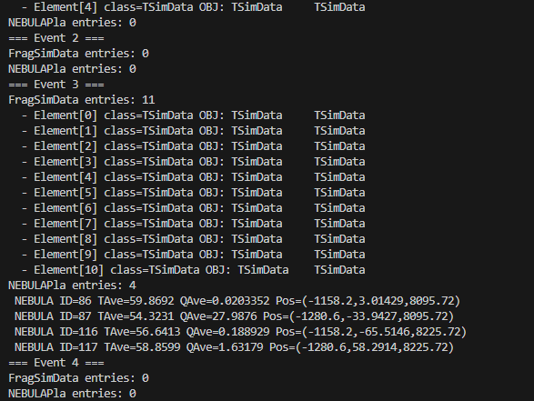
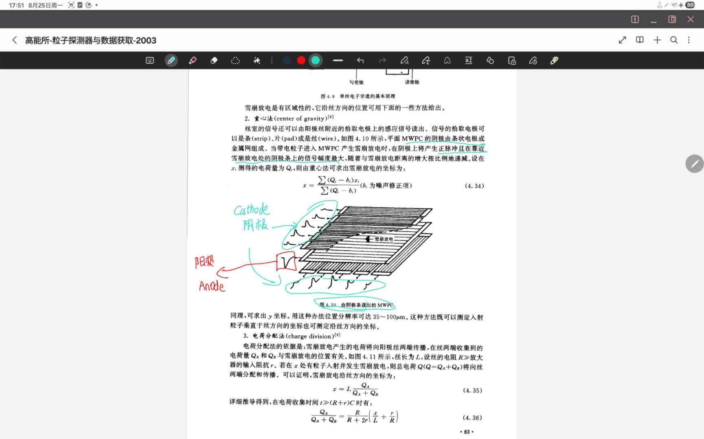

# 周工作汇报（近 7 天）

范围：2025-08-22 ～ 2025-08-28（近 7 天内的提交）

编写人：Baiting Tian

---

## 本周要点摘要
- 主要改动集中在：Tree 输入的交互稳定性修复、NEBULA converter 的空指针保护、为重建/可视化准备并完善若干宏与文档，以及若干与 PDC 绘图/几何相关的文件调整。
- 已新增调试、重建与查看用的宏和 README，便于复现与验证数据流。

---

## 提交明细（按时间倒序）

10. 5eb3201 — 2025-08-26 12:00:30 +0900
    - 作者：Baiting Tian
    - 标题（缩写）：plot cathode wires
    - 变更文件：多处新增/修改，包括 `d_work/geometry/*`、`d_work/macros/examples/*`、`sim_deuteron` 下若干文件等
    - 要点：加入二维/三维 PDC 线结构绘图脚本、几何文件与示例宏，扩充示例和工具链。
    - 验证：运行 `sim_deuteron` 的绘图脚本查看生成图像；确认几何文件在仿真中生效。

9. 336877f — 2025-08-26 12:11:24 +0900
    - 作者：Baiting Tian
    - 标题（缩写）：git ignore big files
    - 变更文件：`.gitignore` 更新，同时删除一批大型 geometry 与临时文件的跟踪
    - 要点：进一步清理仓库历史与不必要的大文件。

8. e47c1d6 — 2025-08-27 14:22:14 +0900
    - 作者：Baiting Tian
    - 标题（缩写）：plot wires add legend
    - 变更文件：重命名/移动与 PDC 绘图相关的文件，添加绘图资源（png）并移除过时副本。
    - 要点：改进 PDC 电极线绘图脚本和图示资源。

7. 5117c6f — 2025-08-27 14:26:11 +0900
    - 作者：Baiting Tian
    - 标题（缩写）：remove large file
    - 变更文件：更新 `.gitignore`，移除大文件历史记录（删除部分 build 临时文件）
    - 要点：清理仓库，避免提交过大的中间文件。

6. a1fa8ee — 2025-08-27 15:46:48 +0900
    - 作者：Baiting Tian
    - 标题（缩写）：add output tree readme.md
    - 变更文件：新增 `d_work/macros/dpol/reconstruction/show_root_detail.cc`、`d_work/output_tree/README.md` 等
    - 要点：补充输出树的查看说明与宏，方便分析人员使用。
    - 验证：运行对应宏查看输出树结构与分支。

5. 9a7b943 — 2025-08-28 16:08:12 +0900
    - 作者：Baiting Tian
    - 标题（缩写）：add code of creating inputtree using TBeamSimdataarray
    - 变更文件：新增多项（事件生成与转换相关脚本/宏），如 `d_work/analyze_frag.C`、`d_work/macros/dpol/EventGenerator/GenInputRoot_np_atime.cc` 等；并修改 `d_work/vis.mac`、`d_work/simulation.mac` 等
    - 要点：加入生成输入 TTree 的示例代码和工具，完善事件生成 pipeline。
    - 验证：用新脚本生成 input root，再用 `PrimaryGeneratorActionBasic` 的 Tree 模式读取并运行短例。

4. 30e45cb — 2025-08-28 16:19:50 +0900
    - 作者：Baiting Tian
    - 标题（缩写）：fix(NEBULA): guard against missing parameters in NEBULASimDataConverter
    - 变更文件：`smg4lib/data/sources/src/NEBULASimDataConverter_TArtNEBULAPla.cc`（M）
    - 要点：同上，具体实现文件中加入空指针校验与防护。
    - 验证：见上条。

3. 618e247 — 2025-08-28 16:22:35 +0900
    - 作者：Baiting Tian
    - 标题（缩写）：上一个提交还干了，Add null-check for NEBULAParameter in ConvertSimData()
    - 变更文件：若干库与中间目标（包括 smg4lib 的库文件变更）
    - 要点：为 NEBULA converter 添加空检查、在缺少参数时跳过并打印警告、只有在参数有效后才创建 `TArtNEBULAPla`，以避免 placement-new 在无效数据上引起未定义行为。
    - 验证：重建 `smg4lib`，运行短例观察是否仍有与 `TArtDataObject::Copy` 相关的 segfault。

2. 5710084 — 2025-08-28 16:55:59 +0900
    - 作者：Baiting Tian
    - 标题（缩写）：reconstruct one evnt to see pdc and nebula
    - 变更文件：新增/修改多文件，包括 `d_work/macros/dpol/data_flow_README.md`（A），`d_work/macros/dpol/reconstruction/reconstruct_one_event.cc`（M）等
    - 要点：增加用于查看 PDC/NEBULA 数据的宏与数据流说明，便于在 ROOT 中快速检查输出树内容。
    - 验证：在 `d_work/macros/dpol/reconstruction` 中使用 `reconstruct_one_event.cc` 打开 `output_tree/test0000.root` 并打印示例信息。

1. 708a72f — 2025-08-28 17:13:12 +0900
    - 作者：Baiting Tian
    - 标题（缩写）：fix(action): keep Tree input TFile open after TreeBeamOn to allow repeated calls
    - 变更文件：`smg4lib/action/src/PrimaryGeneratorActionBasic.cc`（修改）
    - 要点：在 `TreeBeamOn` 结束时不再关闭输入 ROOT 文件，修复在交互式会话中第二次调用 `/action/gun/tree/beamOn` 导致的崩溃问题。
    - 验证：重建 `smg4lib` 与 `sim_deuteron`，在 UI 中两次执行 `/action/gun/tree/beamOn` 不应再发生 segfault。

---

## 本周验证状态（总体）
- 已完成：代码修改已保存；`sim_deuteron` 在本地有过 `make` 成功记录；若干查看宏可在 ROOT 中运行（`reconstruct_one_event.cc` 已被执行）。

输入

模拟

读取模拟数据

下一步，
调好各个数据结构。 特别是target相关设置。

熟悉输出结构的调用方式。

PDC阴极读出模拟？ 如何确定感应电荷，然后确定位置。 误差怎么加

