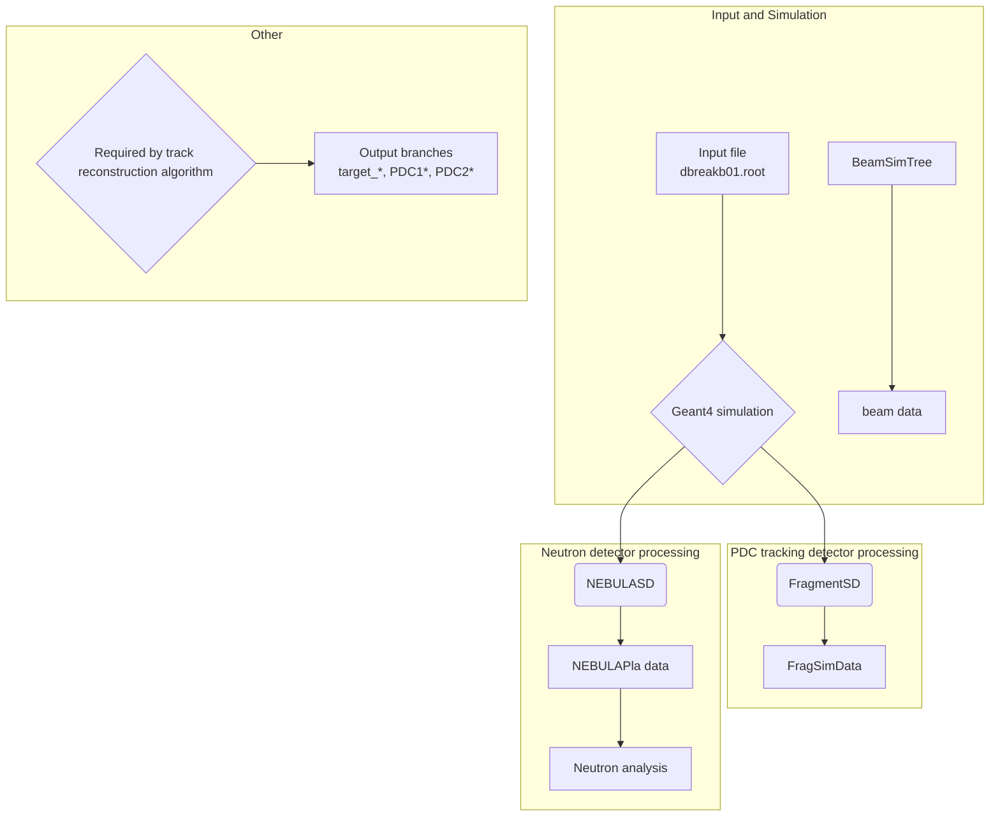
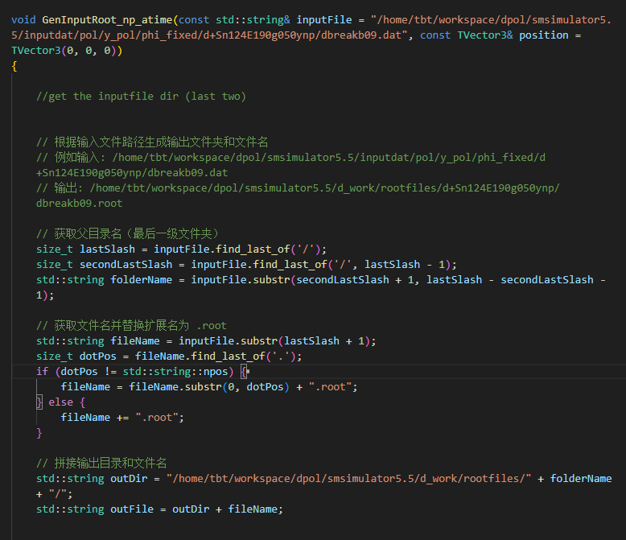
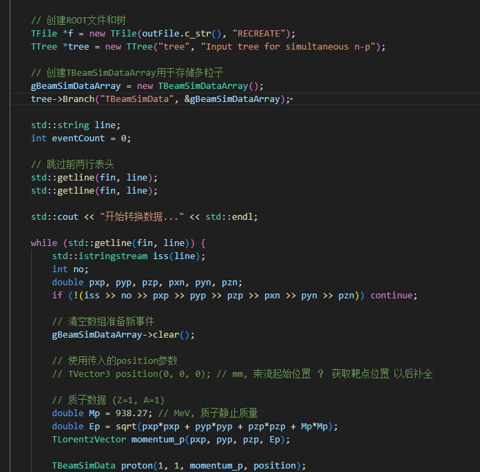
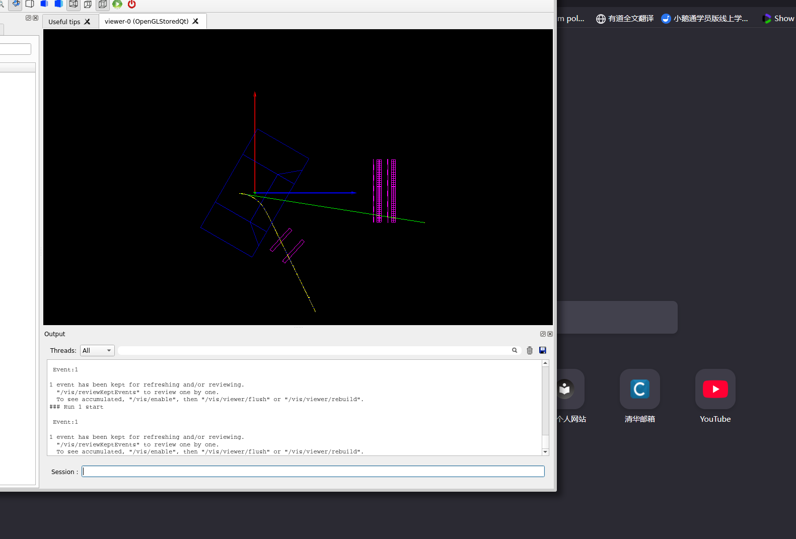
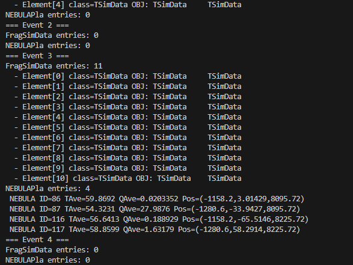
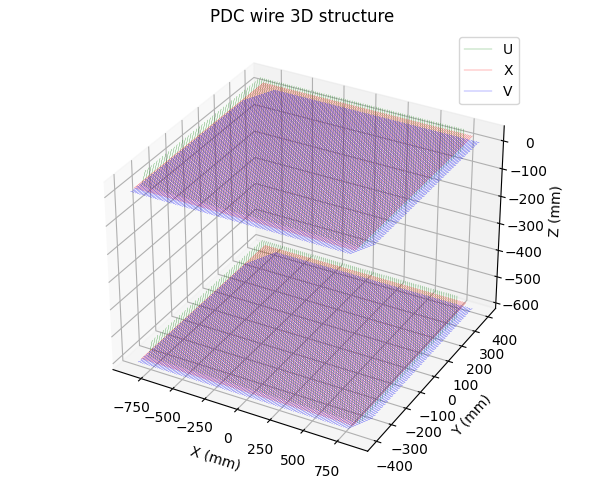
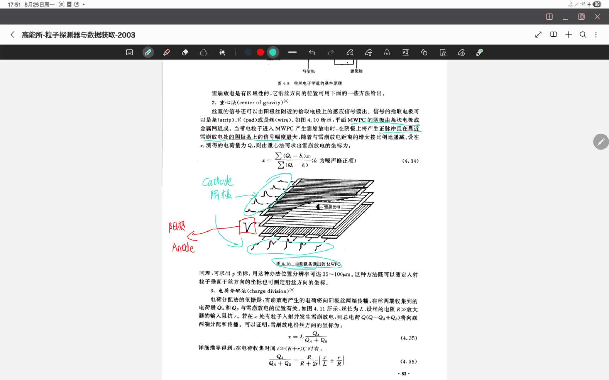

Data flow description

According to the simulation workflow, the main data flow is as follows:

## Figures / screenshots
The report includes in-repo screenshots (referenced by path):

## Next steps
- Finish tuning data structures, especially those related to the target configuration.  
- Become familiar with the output data structures and the APIs used to read them.  
- PDC cathode readout simulation: define how induced charge is estimated, how positions are reconstructed, and how measurement uncertainties are modeled and applied.

---

                

