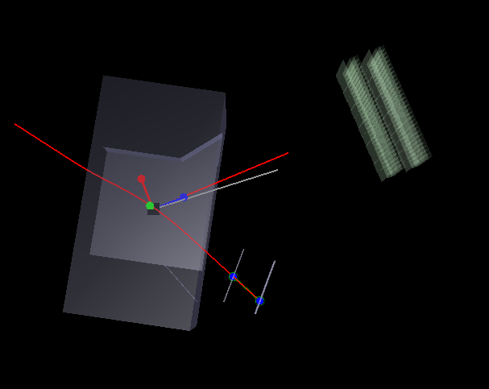
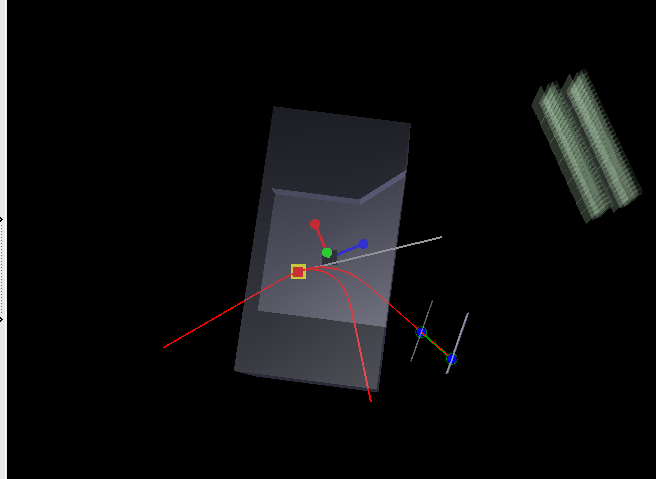
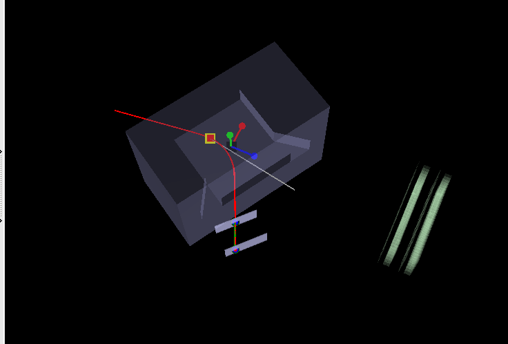

# smsimulator


## 1. Project Goals

This project aims to perform detailed particle physics simulations using `smsimulator` (based on Geant4) to achieve the following core objectives:

- **Optimization of Detector Layout**: To evaluate and optimize the relative positions of the Target and the Particle Drift Chambers (PDC) through simulation data, aiming for the best particle detection efficiency and resolution.
- **Full-chain Simulation and Reconstruction**: To establish a complete simulation workflow, from particle generation, transport, and detection to final data reconstruction and analysis, providing reliable data for physics analysis.

---

## 2. Simulation Stage (smsimulator)

### 2.1. Simulation Control and Data Output

We use Geant4 macro files (`.mac`) to flexibly control various parameters in the simulation, especially the positions of the detectors and the target. This allows for a systematic scan of different geometric layouts.

After the simulation, key physics information is saved in a ROOT Tree. It primarily contains two types of data:

- **Incident Particle Information**:
  - `n`: Neutron information in the event.
  - `p`: Proton information in the event.
  - `momente`: Momentum vector of the particles.

- **Detector Hit Information**:
  - **PDC (Drift Chamber)**: Stored in the `FragSimData` branch, which records fragment information as particles pass through the PDC.
  - **NEBULA (Neutron Detector)**: Stored using a specific data format built into `smsimulator`.

### 2.2. Correction of Data Recording in `FragmentSD.cc`

In earlier versions of the simulation code, we discovered that `FragmentSD.cc` (the sensitive detector class for handling fragments) did not correctly record the energy deposit of particles in the detector. To fix this, we modified the code as follows to ensure the energy deposit is accurately calculated and stored:

```cpp
// Get the SimDataManager instance
SimDataManager *sman = SimDataManager::GetSimDataManager();
// Find the data array named "FragSimData"
TClonesArray *SimDataArray = sman->FindSimDataArray("FragSimData");

// ... inside the loop processing each step ...

// Get the total energy deposit from aStep and convert it to MeV
Double_t energyDeposit_MeV = aStep->GetTotalEnergyDeposit() / MeV;  

// ...

// Store the calculated energy deposit into the data object
data->fEnergyDeposit = energyDeposit_MeV;
```
This correction ensures that the energy deposit information can be accurately used in subsequent analysis.

---

## 3. Analysis and Reconstruction Stage



To process and analyze the data generated by `smsimulator`, we have developed a ROOT-based analysis tool library. The structure of this library is as follows:

```
.
├── macros/                     # ROOT analysis macros
│   ├── run_display.C           # Main display script for event visualization
│   ├── test_run_display.C      # Functional test script
│   └── ...
├── sources/                    # C++ source code
│   ├── include/
│   │   ├── EventDataReader.hh    # Event data reading
│   │   ├── EventDisplay.hh       # 3D event display
│   │   ├── GeometryManager.hh    # Geometry parameter management
│   │   ├── MagneticField.hh      # Magnetic field data handling
│   │   ├── ParticleTrajectory.hh # Particle trajectory calculation
│   │   ├── PDCSimAna.hh          # PDC data reconstruction
│   │   ├── RecoEvent.hh          # Data structure for reconstructed events
│   │   └── TargetReconstructor.hh# Target momentum reconstruction
│   └── src/
│       ├── ... (corresponding .cc implementation files)
└── magnetic_field_test.root    # Pre-processed magnetic field data
```

### 3.1. Core Analysis Tools Explained

#### 3.1.1. `GeometryManager`
This class is responsible for loading and managing the experimental geometry from external files. During initialization, it sets default geometric parameters, such as the positions and angles of the PDCs, which can be updated from a configuration file.

```cpp
// GeometryManager constructor
GeometryManager::GeometryManager()
    : fAngleRad(0.0), fPDC1_Position(0,0,0), fPDC2_Position(0,0,0)
{
    // Default values, can be updated later by LoadGeometry
}
```

#### 3.1.2. `ParticleTrajectory`
This is the core class for trajectory calculation. It uses the **4th-order Runge-Kutta integration method** to accurately calculate the trajectory of charged particles in a non-uniform magnetic field. This method significantly improves the accuracy of the trajectory calculation by performing four intermediate evaluations within each time step `dt`.

The core implementation of the Runge-Kutta algorithm in the code is shown below:

```cpp
// Calculate initial energy
double E0 = TMath::Sqrt(p0.Mag2() + mass*mass);

// --- 4th-Order Runge-Kutta Integration Steps ---
// K1: Derivatives at time t0
TVector3 k1_r = p0 * (kSpeedOfLight * kSpeedOfLight / E0); // dr/dt = v
TVector3 k1_p = CalculateForce(r0, p0, charge);           // dp/dt = F

// K2: Derivatives at time t0 + dt/2
TVector3 r1 = r0 + k1_r * (dt/2);
TVector3 p1 = p0 + k1_p * (dt/2);
// ... calculate k2_r and k2_p ...

// K3: Derivatives at time t0 + dt/2 (second estimate)
// ...

// K4: Derivatives at time t0 + dt
// ...

// --- Final Step Update ---
// Weighted average update for position and momentum
TVector3 r_new = r0 + (k1_r + 2*k2_r + 2*k3_r + k4_r) * (dt/6);
TVector3 p_new = p0 + (k1_p + 2*k2_p + 2*k3_p + k4_p) * (dt/6);
```

### 3.2. Visualization Results

We use the `EventDisplay` class to visualize the simulation and reconstruction results in 3D. The image below shows a typical event display, including the detector geometry, particle tracks, and reconstructed points.


---

## 4. Current Issues and To-Do List

In our current analysis, we have identified the following issues that need to be addressed:

- **Incorrect Target Position**: The position of the target may not be set correctly during the input stage for `(n, p)` events, leading to an inaccurate starting point for reconstruction.
- **Initial Particle Rotation**: The initial neutrons and protons need to be rotated by **-5 degrees** around the Y-axis at generation to match the coordinate system of the SAMURAI magnet.

The next steps will focus on resolving these issues and further refining the reconstruction algorithms to improve momentum and position resolution.


now  






## imdqmd ana

```
❯ du -h --max-depth=1
26G     ./y_pol
37M     ./unpol
9.7G    ./z_pol
15M     ./new
36G     .
```


y_pol
```
593M    ./phi_random/d+Xe130E190g085ypn
646M    ./phi_random/d+Xe130E190g065ypn
913M    ./phi_random/d+Pb208E190g050ypn
702M    ./phi_random/d+Pb208E190g080ypn
805M    ./phi_random/d+Pb208E190g060ynp
644M    ./phi_random/d+Xe130E190g065ynp
762M    ./phi_random/d+Pb208E190g065ynp
632M    ./phi_random/d+Xe130E190g070ypn
849M    ./phi_random/d+Pb208E190g055ypn
697M    ./phi_random/d+Pb208E190g080ynp
685M    ./phi_random/d+Pb208E190g085ynp
717M    ./phi_random/d+Pb208E190g075ypn
600M    ./phi_random/d+Xe130E190g080ynp
691M    ./phi_random/d+Pb208E190g085ypn
805M    ./phi_random/d+Pb208E190g060ypn
912M    ./phi_random/d+Pb208E190g050ynp
739M    ./phi_random/d+Pb208E190g070ypn
603M    ./phi_random/d+Xe130E190g080ypn
770M    ./phi_random/d+Pb208E190g065ypn
672M    ./phi_random/d+Xe130E190g060ynp
713M    ./phi_random/d+Pb208E190g075ynp
729M    ./phi_random/d+Pb208E190g070ynp
611M    ./phi_random/d+Xe130E190g075ynp
743M    ./phi_random/d+Xe130E190g050ypn
593M    ./phi_random/d+Xe130E190g085ynp
705M    ./phi_random/d+Xe130E190g055ynp
847M    ./phi_random/d+Pb208E190g055ynp
673M    ./phi_random/d+Xe130E190g060ypn
613M    ./phi_random/d+Xe130E190g075ypn
739M    ./phi_random/d+Xe130E190g050ynp
708M    ./phi_random/d+Xe130E190g055ypn
630M    ./phi_random/d+Xe130E190g070ynp
25G     ./phi_random
792M    ./erroneous_rotate/phi_rot360
97M     ./erroneous_rotate/phi_rot30
889M    ./erroneous_rotate
6.0M    ./phi_fixed/d+Sn124E190g070ypn
6.4M    ./phi_fixed/d+Sn124E190g080ynp
5.1M    ./phi_fixed/d+Sn124E190g090ypn
1.0M    ./phi_fixed/d+Xe130E190g100ynp
1016K   ./phi_fixed/d+Xe130E190g100ypn
4.5M    ./phi_fixed/d+Sn124E190g050ypn
1.2M    ./phi_fixed/d+Xe130E190g200ypn
1.1M    ./phi_fixed/d+Xe130E190g200ynp
5.4M    ./phi_fixed/d+Sn124E190g060ynp
5.3M    ./phi_fixed/d+Sn124E190g060ypn
5.8M    ./phi_fixed/d+Sn124E190g070ynp
6.2M    ./phi_fixed/d+Sn124E190g100ypn
6.2M    ./phi_fixed/d+Sn124E190g100ynp
4.5M    ./phi_fixed/d+Sn124E190g050ynp
888K    ./phi_fixed/d+Xe130E190g050ypn
5.5M    ./phi_fixed/d+Sn124E190g090ynp
840K    ./phi_fixed/d+Xe130E190g050ynp
6.7M    ./phi_fixed/d+Sn124E190g080ypn
73M     ./phi_fixed
```


zpol

```
556M    ./b_continuous/d+Xe130E190g075znp
586M    ./b_continuous/d+Xe130E190g070znp
600M    ./b_continuous/d+Xe130E190g065zpn
700M    ./b_continuous/d+Xe130E190g050zpn
556M    ./b_continuous/d+Xe130E190g085znp
630M    ./b_continuous/d+Xe130E190g060zpn
582M    ./b_continuous/d+Xe130E190g075zpn
579M    ./b_continuous/d+Xe130E190g070zpn
658M    ./b_continuous/d+Xe130E190g055zpn
632M    ./b_continuous/d+Xe130E190g080zpn
608M    ./b_continuous/d+Xe130E190g065znp
662M    ./b_continuous/d+Xe130E190g055znp
695M    ./b_continuous/d+Xe130E190g050znp
558M    ./b_continuous/d+Xe130E190g080znp
632M    ./b_continuous/d+Xe130E190g060znp
582M    ./b_continuous/d+Xe130E190g085zpn
9.6G    ./b_continuous
2.6M    ./b_discrete/d+Sn112E190g080zpn
1.3M    ./b_discrete/d+Sn124E190g050znp
1.4M    ./b_discrete/d+Sn124E190g060zpn
1.1M    ./b_discrete/d+Sn124E190g050zpn
1.5M    ./b_discrete/d+Sn112E190g060zpn
2.2M    ./b_discrete/d+Pb208E190g080znp
1.3M    ./b_discrete/d+Sn112E190g090znp
1.3M    ./b_discrete/d+Pb208E190g060zpn
1.7M    ./b_discrete/d+Pb208E190g060znp
1.6M    ./b_discrete/d+Xe130E300g100zpn
1.2M    ./b_discrete/d+Sn112E190g050znp
1.4M    ./b_discrete/d+Sn124E190g080znp
3.2M    ./b_discrete/d+Pb208E190g070zpn
1.1M    ./b_discrete/d+Sn112E190g070znp
976K    ./b_discrete/d+Sn112E190g050zpn
1.5M    ./b_discrete/d+Sn124E190g060znp
528K    ./b_discrete/d+Xe130E250g100znp
3.7M    ./b_discrete/d+Pb208E190g100zpn
904K    ./b_discrete/d+Xe130E190g050zpn
1.5M    ./b_discrete/d+Sn124E190g055zpn
3.2M    ./b_discrete/d+Sn112E190g090zpn
3.0M    ./b_discrete/d+Pb208E190g100znp
1.6M    ./b_discrete/d+Pb208E190g050zpn
1.5M    ./b_discrete/d+Pb208E190g070znp
1.5M    ./b_discrete/d+Xe130E190g200zpn
1.9M    ./b_discrete/d+Sn124E190g080zpn
2.2M    ./b_discrete/d+Pb208E190g090znp
2.9M    ./b_discrete/d+Sn124E190g090zpn
1.2M    ./b_discrete/d+Pb208E190g050znp
892K    ./b_discrete/d+Xe130E190g200znp
1.3M    ./b_discrete/d+Sn124E190g070zpn
3.6M    ./b_discrete/d+Pb208E190g090zpn
1.3M    ./b_discrete/d+Xe130E190g100zpn
736K    ./b_discrete/d+Xe130E190g100znp
1.5M    ./b_discrete/d+Sn124E190g055znp
2.1M    ./b_discrete/d+Sn112E190g070zpn
3.5M    ./b_discrete/d+Pb208E190g080zpn
3.2M    ./b_discrete/d+Sn112E190g100zpn
1.8M    ./b_discrete/d+Sn112E190g080znp
1.1M    ./b_discrete/d+Xe130E300g100znp
948K    ./b_discrete/d+Xe130E190g050znp
980K    ./b_discrete/d+Sn124E190g100znp
1004K   ./b_discrete/d+Sn124E190g070znp
3.0M    ./b_discrete/d+Sn124E190g100zpn
1.3M    ./b_discrete/d+Sn112E190g100znp
1.2M    ./b_discrete/d+Sn124E190g090znp
1.5M    ./b_discrete/d+Sn112E190g060znp
1.6M    ./b_discrete/d+Xe130E250g100zpn
82M     ./b_discrete
9.7G    .
```

## Interactive 3D visualization


<iframe src="/smsimulator5.5/d_work/macros/inputana/output/interactive_3d_momentum_by_target.html" width="100%" height="600" frameborder="0"></iframe>


[link](/smsimulator5.5/d_work/macros/inputana/output/interactive_3d_momentum_by_target.html)

/home/tian/workspace/dpol/smsimulator5.5/d_work/macros/inputana/output/interactive_3d_momentum_by_target.html

/home/tian/workspace/dpol/smsimulator5.5/d_work/macros/inputana/output/interactive_3d_momentum_by_target.html

/home/tian/workspace/dpol/home/tian/workspace/dpol/smsimulator5.5/d_work/macros/inputana/output/interactive_3d_momentum_by_target.html