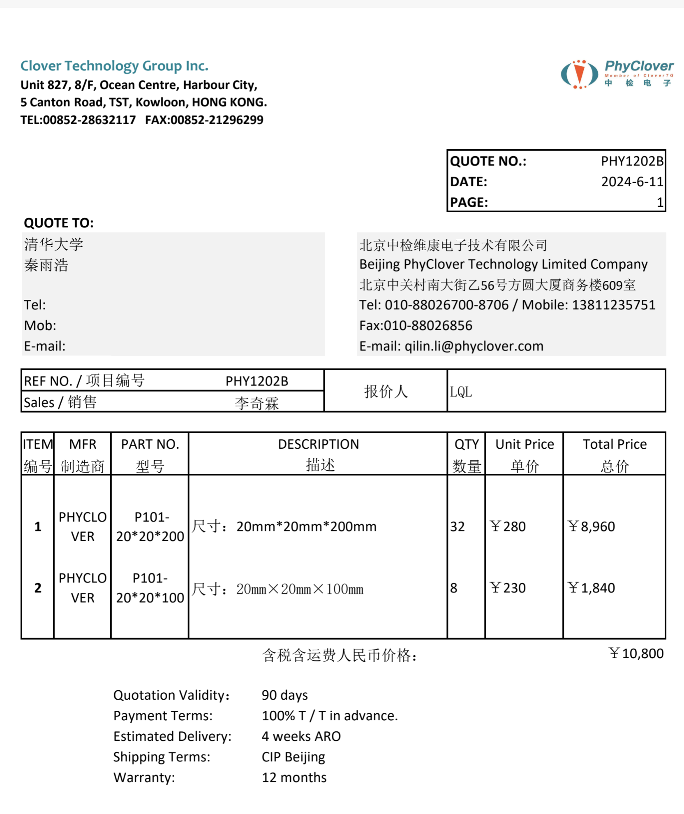

# Veto Impact Parameter Selector (IPS)

> See also:
> `docs/mechanic/veto_impactPrameterSelector/ips_scan_3deg_1p15T_no_forward.zh.md`

## 1. Overview

本装置为一套 **32通道环形塑料闪烁体阵列（Veto / IPS）**，安装于靶区周围，用于：

* 探测大角度带电碎片（p, d, fragments）
* 进行事件筛选（veto）
* 辅助触发（trigger / coincidence）
* 提供反应顶点相关信息（impact parameter selection）

---

## 2. Detector Configuration

### 2.1 Geometry

* 探测器类型：环形塑料闪烁体阵列
* 通道数：32
* 模块尺寸：20 mm × 20 mm × 200 mm（长条形）
* 排布方式：圆周均匀分布（360°覆盖）
* 每个模块沿径向指向

### 2.2 Dimensions

| 参数          | 数值            |
| ----------- | ------------- |
<!-- | 内径          | 241 mm        |
| 外径          | 339 mm        | -->
| 闪烁体中心距离中心轴        |  135 mm      |
| 模块数量        | 32            |
| 单块截面        | 20 mm × 20 mm |
| 模块间距（pitch） | ≈ 23 mm       |

👉 每个模块角分辨率：

[
\Delta \phi \approx 360^\circ / 32 \approx 11.25^\circ
]

---

## 3. Scintillator Material

* 型号：P101
* 基底材料：聚苯乙烯（Polystyrene）
* 化学式：((C_8H_8)_n)



### 3.1 典型性能

| 参数   | 数值                  |
| ---- | ------------------- |
| 发光波长 | ~420 nm             |
| 光产额  | ~10,000 photons/MeV |
| 衰减时间 | ~2–3 ns             |
| 折射率  | ~1.58               |

---

## 4. Detector Placement

* 安装位置：靶区周围（Target-centered geometry）,需要进一步优化位置


---

## 5. Physics Role

### 5.1 Veto Function（核心）

用于剔除非目标物理过程：

* 多体反应
* 非弹性散射
* 杂散背景粒子

触发逻辑示例：

```text
Forward detector AND NOT (IPS hit)
```

---

### 5.2 Fragment Detection

探测靶区附近产生的：

* 大角度质子（p）
* 氘核（d）
* 其他带电碎片

---

### 5.3 Impact Parameter Selection

通过探测碎片分布：

* 关联反应几何（central vs peripheral）
* 用于事件分类（event topology selection）

---

### 5.4 Trigger / Multiplicity

* 计数 multiplicity
* 提供 fast trigger 信号（ns级）

---

## 6. Performance Characteristics

| 项目   | 特性           |
| ---- | ------------ |
| 时间响应 | 快（~ns级）      |
| 角覆盖  | 360°         |
| φ分辨率 | ~11°         |
| ΔE能力 | 中等（适合粒子鉴别辅助） |

---


---


---

## 7. Summary

该 IPS / Veto 环形阵列的本质作用为：

> **事件筛选器（Event Filter） + 碎片探测器**

其主要贡献在于：

* 提高信噪比
* 抑制背景
* 提供反应几何信息

---
