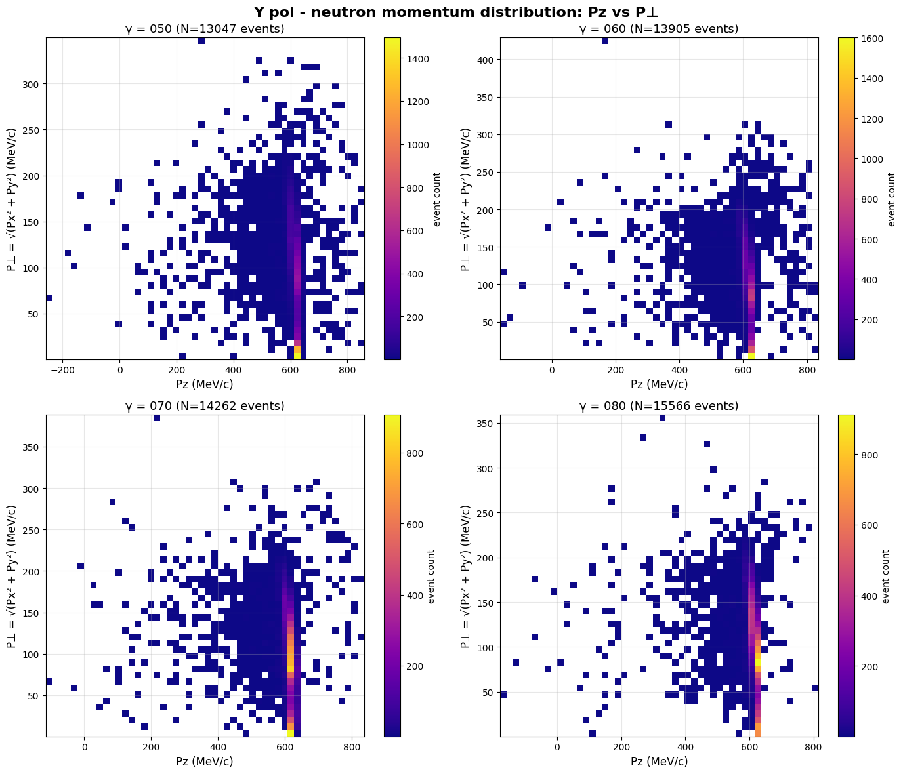
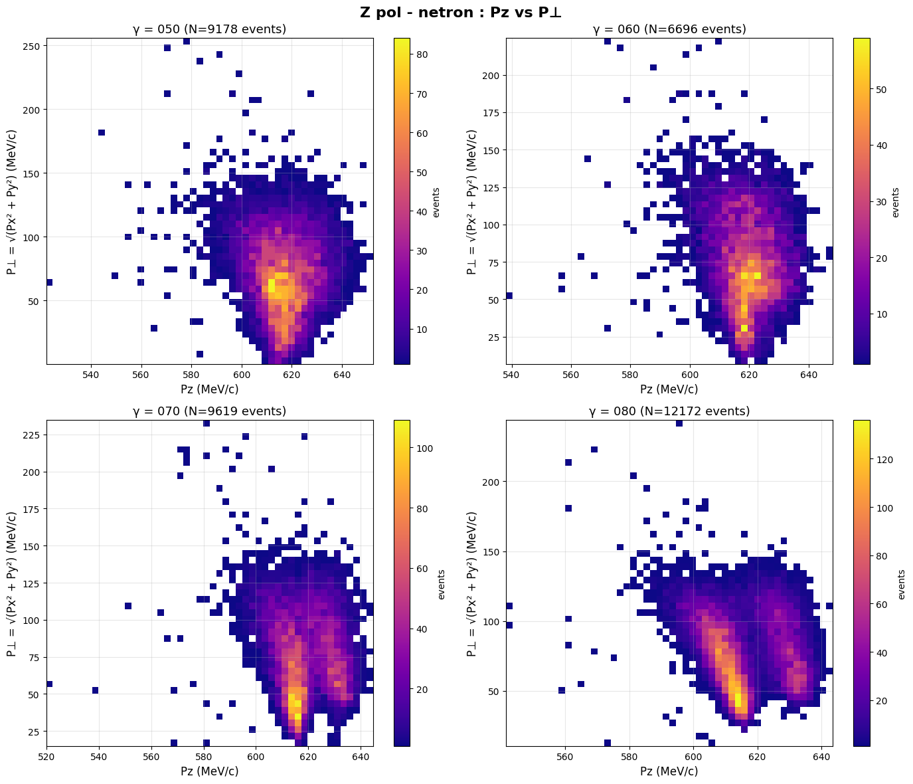
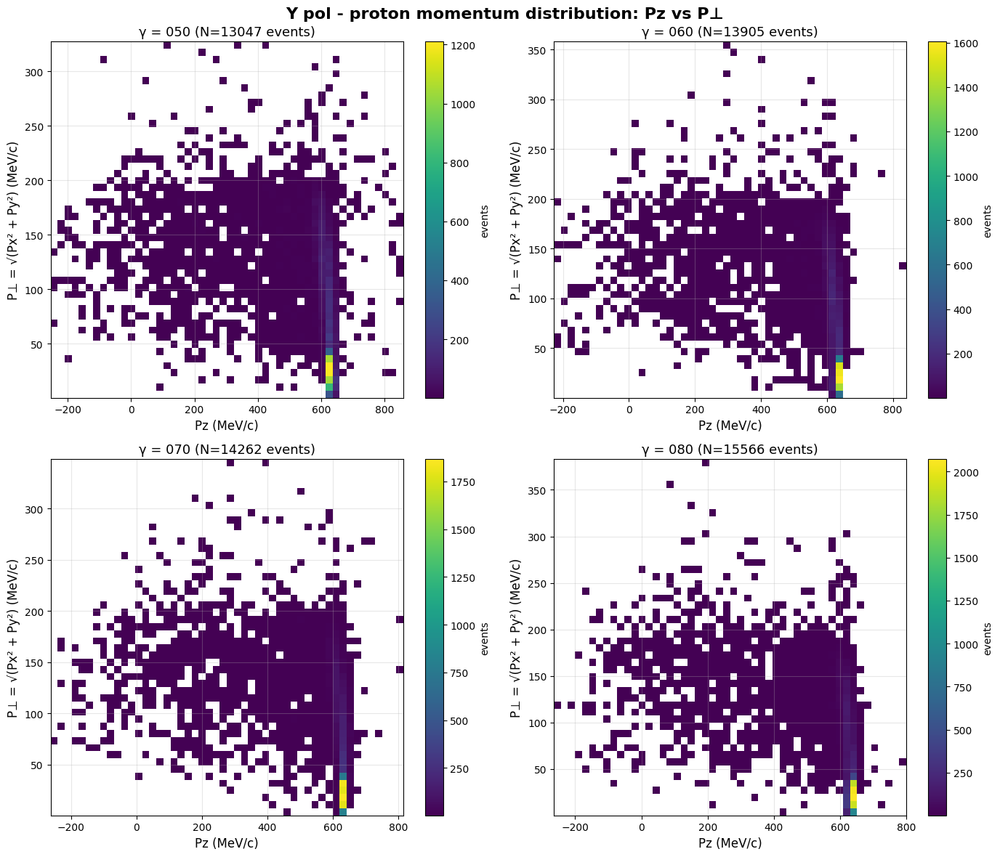
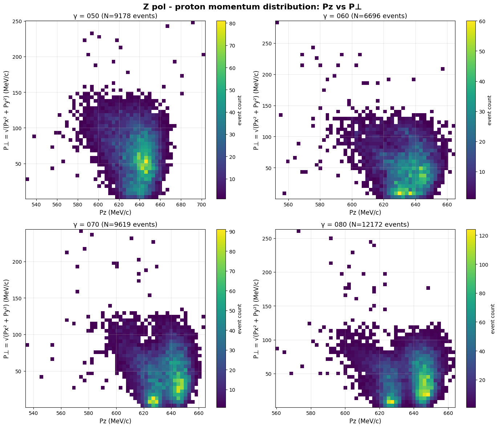
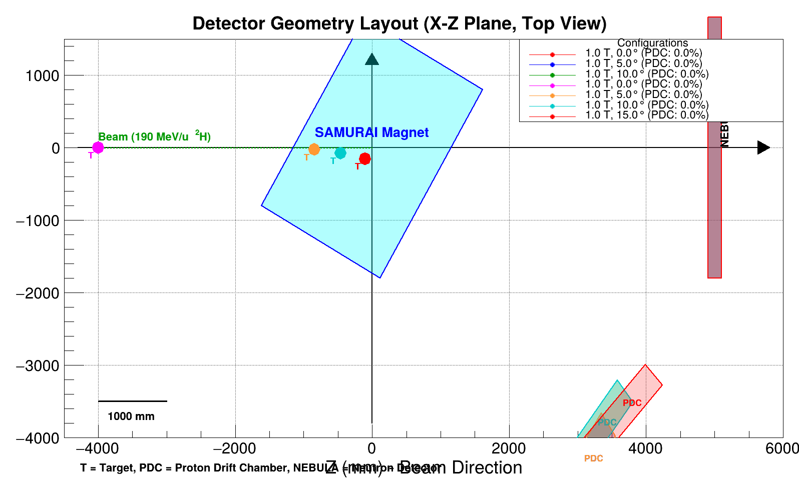
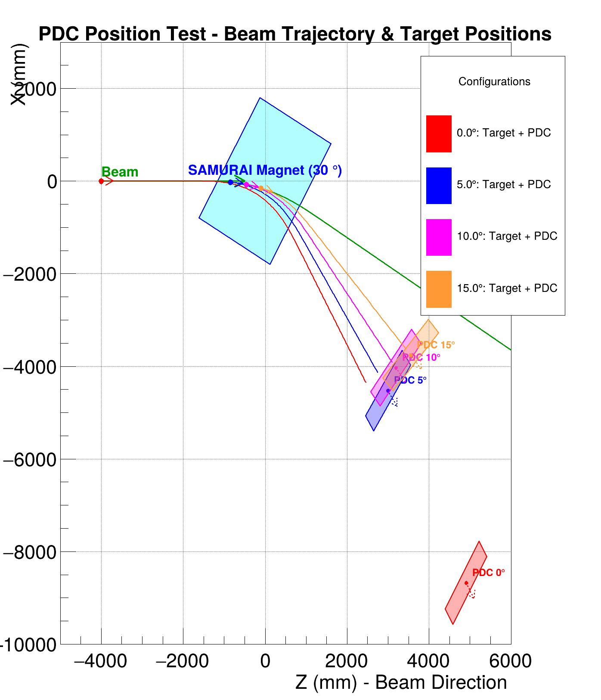

# 2025-11 log

## 2025-11-29
更改data目录下的文件命名，使得其容易辨析。

smsimulator5.5/scripts/notebooks/input_analysis/zpol_ypol_show_approx_P.ipynb

gammas = ["050", "060", "070","080"]  # 不同的 gamma 值
target = "Pb208"  的数据


显示特征动量：


中子的特征量 



Y pol - neutron momentum statistics:

γ=050:
  Pz: mean=612.7, std=52.2, range=[-259.1, 858.5]
  P⊥: mean=80.3, std=59.1, range=[0.1, 350.0]

γ=060:
  Pz: mean=613.5, std=44.5, range=[-161.8, 835.9]
  P⊥: mean=86.0, std=57.1, range=[0.1, 429.0]

γ=070:
  Pz: mean=612.1, std=43.9, range=[-115.2, 837.3]
  P⊥: mean=90.5, std=52.6, range=[0.1, 388.5]

γ=080:
  Pz: mean=612.6, std=39.6, range=[-178.0, 815.6]
  P⊥: mean=94.1, std=50.4, range=[0.3, 359.0]



Z pol - neutron momentum statistics:

γ=050:
  Pz: mean=616.6, std=10.3, range=[522.2, 652.4]
  P⊥: mean=69.4, std=30.9, range=[0.4, 255.6]

γ=060:
  Pz: mean=619.2, std=8.6, range=[538.1, 648.1]
  P⊥: mean=74.5, std=30.1, range=[6.8, 224.5]

γ=070:
  Pz: mean=618.8, std=9.8, range=[519.8, 644.8]
  P⊥: mean=75.7, std=27.5, range=[14.9, 234.7]

γ=080:
  Pz: mean=616.0, std=11.0, range=[541.5, 643.6]
  P⊥: mean=78.0, std=25.4, range=[10.6, 243.8]

质子的特征量


Y pol - proton momentum statistics:

γ=050:
  Pz: mean=586.7, std=124.6, range=[-254.1, 859.1]
  P⊥: mean=69.0, std=56.6, range=[0.2, 327.3]

γ=060:
  Pz: mean=596.4, std=111.4, range=[-227.6, 840.9]
  P⊥: mean=60.3, std=53.6, range=[0.1, 357.9]

γ=070:
  Pz: mean=602.1, std=105.3, range=[-262.3, 815.2]
  P⊥: mean=53.4, std=50.8, range=[0.2, 348.4]

γ=080:
  Pz: mean=604.7, std=103.1, range=[-264.4, 800.4]
  P⊥: mean=49.2, std=48.7, range=[0.3, 382.9]



Z pol - proton momentum statistics:

γ=050:
  Pz: mean=636.1, std=15.6, range=[529.3, 703.6]
  P⊥: mean=62.7, std=32.8, range=[0.6, 250.2]

γ=060:
  Pz: mean=634.0, std=12.6, range=[551.7, 665.1]
  P⊥: mean=51.7, std=32.8, range=[0.3, 285.8]

γ=070:
  Pz: mean=634.9, std=13.0, range=[534.0, 664.8]
  P⊥: mean=45.7, std=28.0, range=[0.3, 243.8]

γ=080:
  Pz: mean=637.6, std=12.1, range=[559.3, 664.1]
  P⊥: mean=44.0, std=26.0, range=[0.3, 263.0]


我认为是在中子质子在Pz= 600MeV, Px = $\pm$ 100MeV 左右作为参考的动量比较合适。 


## 2025-11-30

磁场链接 

http://ribf.riken.jp/~hsato/fieldmaps/180703-1,40T-6000.zip

http://ribf.riken.jp/~hsato/fieldmaps/180626-1,20T-6000.zip

http://ribf.riken.jp/~hsato/fieldmaps/180626-1,00T-6000.zip

http://ribf.riken.jp/~hsato/fieldmaps/141114-0,8T-6000.zip


通过磁场中运动 RK算法， 计算P = pz = 600MeV的质子的轨迹 计算Px= $\pm$ 100MeV Pz = 600 MeV/c的粒子。  这三条轨迹中， 中间那条为pdc中心，其余两条为边缘。 计算pdc的最佳位置。 

然后运行qmdrawdata 在执行cut之后的数据， z轴随机化，入射， 查看几何接受度。 






有些老旧代码可能计算错误了  fx fz的长度 磁铁的长度

有些旋转可以旋转错了角度。 由于此处的track的角度 和 磁铁的角度都是 沿着-Y轴旋转的，会产生一些问题。 

```
# 几何接受度分析日志
# 磁场: 0.8T (0.8 T)
# 时间: 2025-11-30 06:35:25.832619
```

这个日志之前应该都有问题。 这个时间之后不一定没问题。 


todo

[] 计算 target position
[] 计算 pdc detec effetioncy