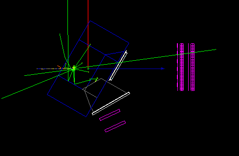
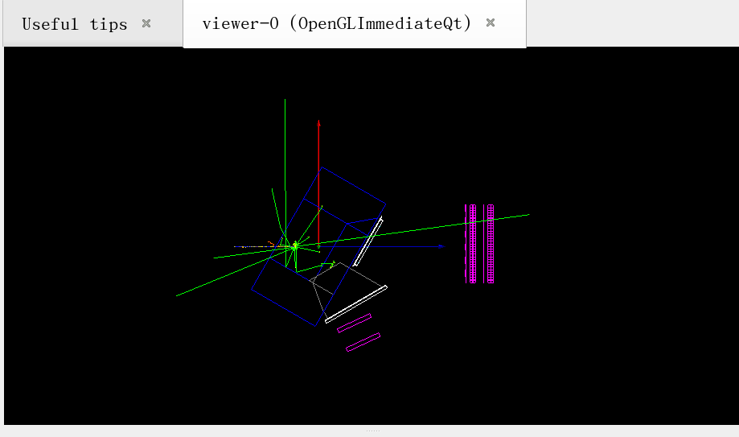

## 1-10

动量分辨率:

### 从角度方面来看,

动量 $p$ 与总偏转角 $\theta_{bend}$ 的关系由场积分 $\int B dl$ 决定：$$\theta_{bend} \approx \frac{0.3 \int B dl}{p}$$.


### 从位置方面看,

改变动量 得到$\frac{\partial{x}}{\partial{p}}$

或者说 是 P对pdc重建直线参数的导数. pdc重建直线参数误差可以通过

### Gluckstern公式

场内探测器:

R.L. Gluckstern 1963

对于在磁场中均匀分布的 $N$ 层探测器，仅由位置测量误差导致的横向动量分辨率为：$$\frac{\sigma_{p_T}}{p_T} = \frac{\sigma_{r\phi} \cdot p_T}{0.3 B L^2} \sqrt{\frac{720}{N+4}}$$


### 考虑和多次散射误差匹配


多重库仑散射（MCS）的限制


$$\theta_{MCS} \approx \frac{13.6 \text{ MeV}}{\beta c p} z \sqrt{\frac{x}{X_0}} [1 + 0.038 \ln(x/X_0)]$$

其中 $x/X_0$ 是以辐射长度为单位的材料厚度。注意到 $\theta_{MCS} \propto 1/p$。


### 重建改进

单参数优化

改为多参数优化


## 1-11

todo 

生成各个配置的pdc位置 mac文件 分文件夹存储.

vis.mac  氘核束流选项 和


原始段错误的原因是磁场文件格式与代码不匹配：

磁场文件 180703-1,40T-6000.table 使用 6000mm 范围、20mm 步长的网格
代码原本只支持 3000mm 范围、10mm 步长的网格
当代码用 v[0]/10 计算数组索引时，6000mm 范围的数据会产生超出数组边界的索引（如 600 > 300）
修复内容
MagField.hh: 添加了 fStepSize 和 fMaxRange 成员变量来存储网格参数

MagField.cc:

构造函数初始化新变量
.table 文件读取时自动检测文件格式（通过读取文件头中的 ny 值）
使用动态步长计算数组索引，并添加边界检查
.bin 文件读取支持新旧两种格式（自动兼容）
GetFieldValue 函数使用动态步长和范围进行插值计算

以及取消这一个变化. 转而下载合适的磁场文件.

##
```
/samurai/geometry/PDC/Angle 65 deg
/samurai/geometry/PDC/Position1 +0 0 400 cm
/samurai/geometry/PDC/Position2 +0 0 500 cm
```
this pdc position is better. 




PrimaryGeneratorActionBasic.cc:362-364
```cpp

  TBeamSimData data;
  data.fPrimaryParticleID = 0;
  data.fZ                 = particle->GetAtomicNumber();
  data.fA                 = particle->GetAtomicMass();
  data.fPDGCode           = particle->GetPDGEncoding();
  data.fParticleName      = particle->GetParticleName();
  data.fCharge            = particle->GetPDGCharge()/eplus;
  data.fMass              = M/MeV;
  data.fTime              = 0;// not implemented
  data.fIsAccepted        = kTRUE;
  data.fMomentum.SetPxPyPzE(0,0,P/MeV,E/MeV);
  data.fMomentum.RotateY(fBeamAngleX/rad);
  data.fMomentum.RotateX(-fBeamAngleY/rad);
  data.fPosition.SetXYZ(fBeamPosition.x()/mm,
			fBeamPosition.y()/mm,
			fBeamPosition.z()/mm);

  gBeamSimDataArray->push_back(data);
  SetPrimaryVertex(anEvent);
}
```

TBeamSimdata has the rotation code.


PrimaryGeneratorActionBasic.cc:407-410
```cpp


```

Angle Rotation Mechanism
Yes, the emission angles are rotated. The angle rotation is implemented differently depending on the beam type:

For Pencil Beam
The momentum vector is created along the Z-axis and then rotated by the beam angles. The rotation is performed using RotateY for the X-angle and RotateX (with negative sign) for the Y-angle: PrimaryGeneratorActionBasic.cc:362-364

For Gaussian Beam
Similar rotation is applied, but the angles are sampled from Gaussian distributions centered at fBeamAngleX and fBeamAngleY with spreads fBeamAngleXSigma and fBeamAngleYSigma: PrimaryGeneratorActionBasic.cc:407-410

For Deuteron-Specific Implementation
The DeutPrimaryGeneratorAction (which inherits from PrimaryGeneratorActionBasic) adds an additional rotation when fUseTargetParameters is enabled. It rotates the beam direction by the negative target angle to transform from the beam frame to the laboratory frame: DeutPrimaryGeneratorAction.cc:50-63

Angle Control
The beam angles are controlled through several member variables and setter methods:

fBeamAngleX and fBeamAngleY: Central beam angles
fBeamAngleXSigma and fBeamAngleYSigma: Angular spreads for Gaussian beam PrimaryGeneratorActionBasic.hh:79-82
These parameters can be set programmatically through methods like SetBeamAngleX(), SetBeamAngleY(), SetBeamAngleXSigma(), and SetBeamAngleYSigma(): PrimaryGeneratorActionBasic.hh:44-47

Particle Emission
After generating the beam data, particles are actually emitted through the SetPrimaryVertex() method. This method reads the TBeamSimData objects from gBeamSimDataArray, configures the G4ParticleGun with the particle properties (type, energy, direction, position), and calls GeneratePrimaryVertex() to emit the particle into the Geant4 event: PrimaryGeneratorActionBasic.cc:140-194





now, pdc used position is fixed at -1690 0 3625 cm , angle 65 deg(geo_feilter definition). (or geant4 mac definition: angle 65 (0,0, 4000))


```bash
# [EN] Target positions: FIELD ANGLE TX TY TZ
    read -r -d '' TARGET_DATA << 'ENDDATA'
080 2.0 -8.1743 0.0046 -1093.7313
080 4.0 -20.6120 0.0063 -851.8761
080 6.0 -37.8391 0.0077 -654.3163
080 8.0 -60.6090 0.0088 -468.7377
080 10.0 -89.3315 0.0100 -287.3597
100 2.0 -7.7287 0.0075 -1151.8117
100 4.0 -18.9698 0.0105 -932.5705
100 6.0 -33.7681 0.0131 -762.6098
100 8.0 -52.6612 0.0157 -608.5314
100 10.0 -76.0454 0.0186 -460.8262
120 2.0 -7.4478 0.0082 -1193.9326
120 4.0 -17.9688 0.0107 -988.3352
120 6.0 -31.3605 0.0133 -834.3431
120 8.0 -47.9353 0.0150 -699.0843
120 10.0 -68.0180 0.0169 -572.1932
160 2.0 -7.0397 0.0098 -1256.1967
160 4.0 -16.6920 0.0118 -1067.2291
160 6.0 -28.5461 0.0144 -930.7559
160 8.0 -42.6748 0.0158 -815.3566
160 10.0 -59.2219 0.0167 -710.7437
200 2.0 -6.6894 0.0134 -1309.1564
200 4.0 -15.6985 0.0153 -1132.5691
200 6.0 -26.5470 0.0178 -1007.5765
200 8.0 -39.2217 0.0192 -904.0010
200 10.0 -53.7761 0.0193 -811.9539
ENDDATA
```