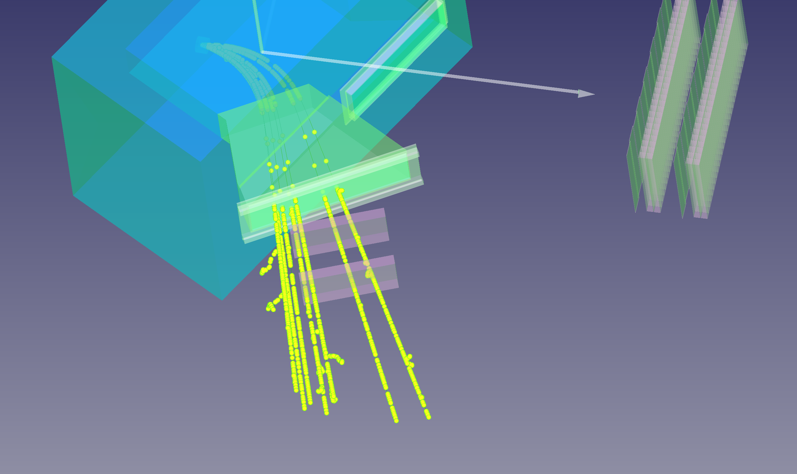
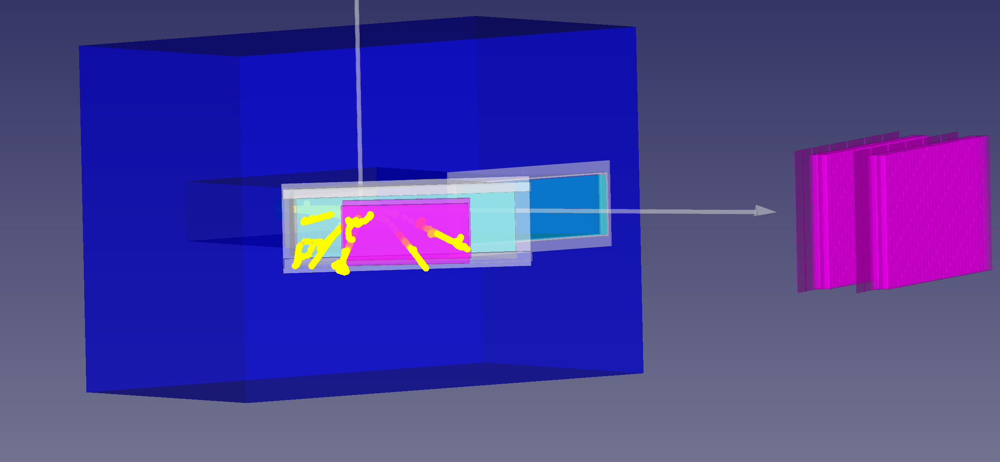
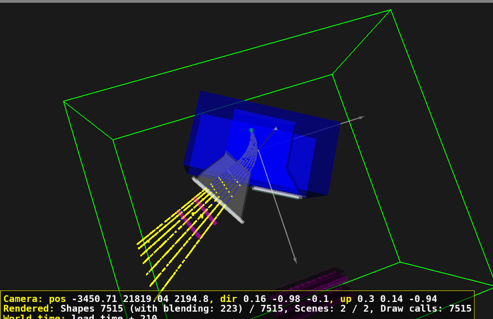
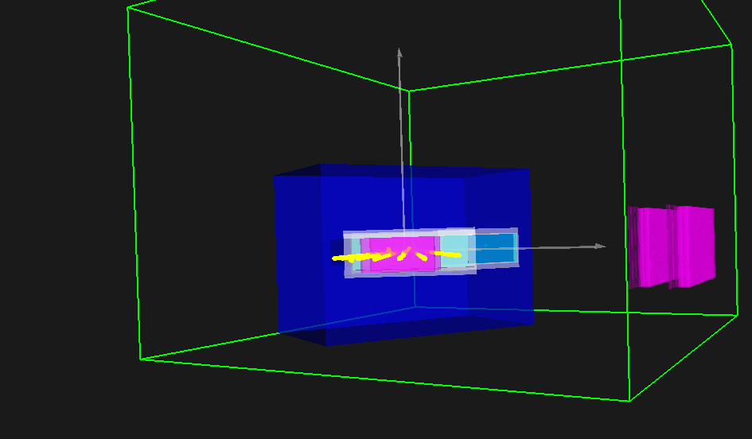
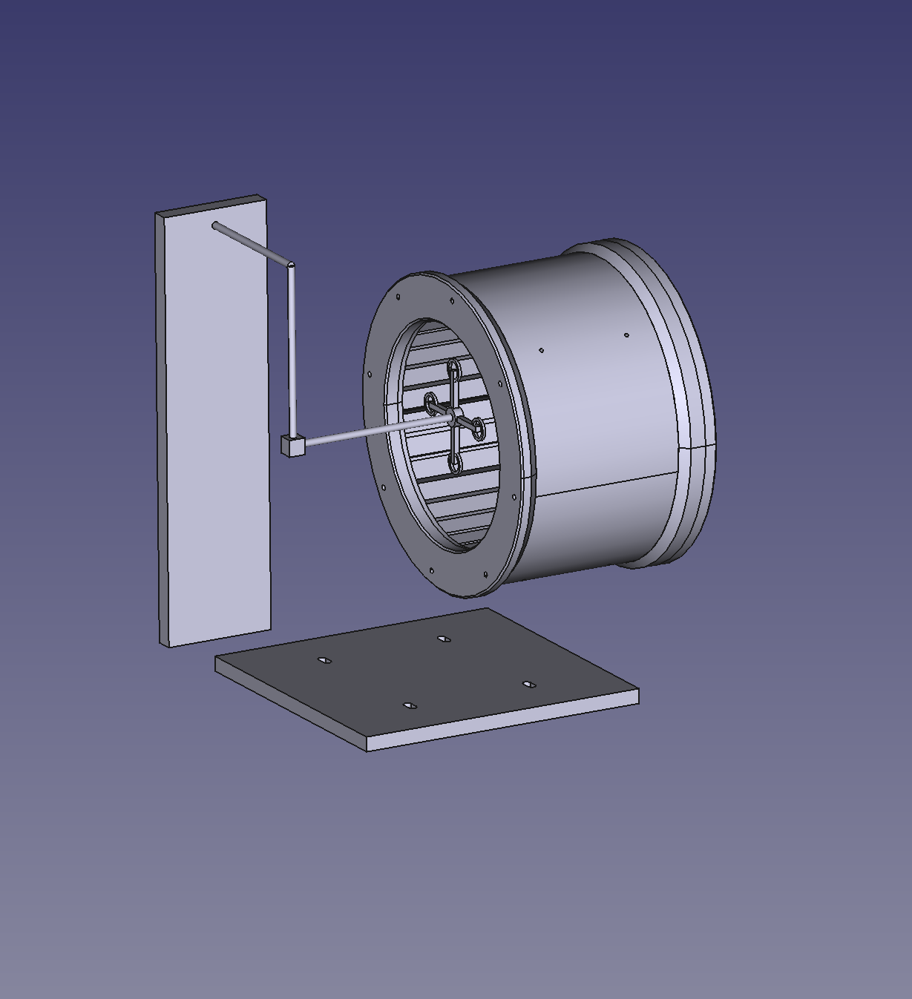

# log202604.md

## pdc

https://www.nishina.riken.jp/ribf/SAMURAI/image/Detector-PDC.pdf
https://www.nishina.riken.jp/researcher/APR/APR054/pdf/11.pdf
https://www.nishina.riken.jp/researcher/APR/APR058/pdf/5.pdf
https://www.nishina.riken.jp/researcher/APR/APR058/pdf/7.pdf
https://ribf.riken.jp/SAMURAI/tkobayashi/ribf/ppN2010/proposal/Proposal_ppn_090517.pdf
https://ribf.riken.jp/SAMURAI/tkobayashi/samuraiD/memo/2015/memo_pdc_20150320.pdf

极化探测器 小型. 光电管.

http://www.grandmv.com/product-detail/BAw1x3rW

## 2026-4-02

px = 150, 100, 50, 0, -50, -100, -150
py = 0
pz =  627

this is because target are set as ture. some particle are reaction with target.

