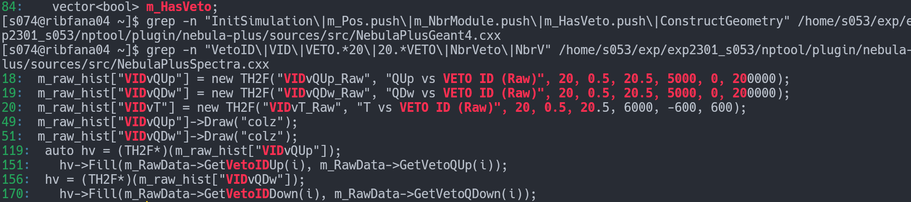
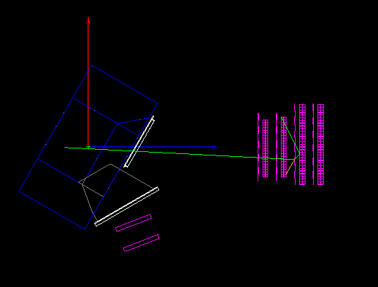
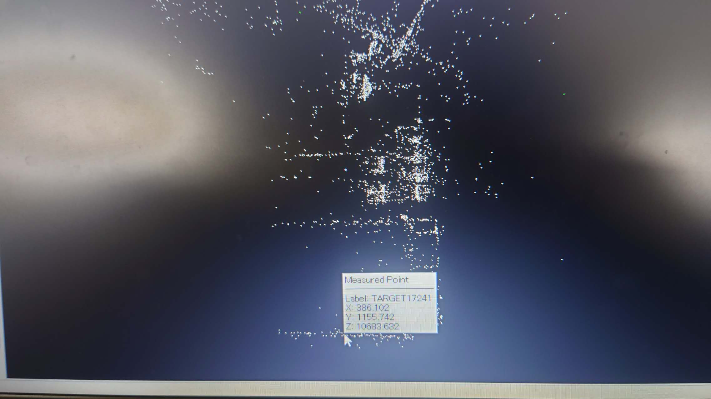
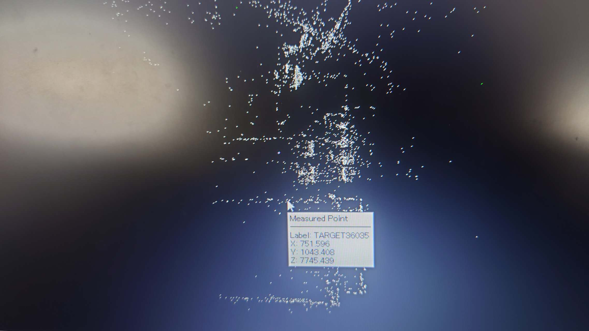

nebula_plus 在线观测显示：

十根veto

phogemotry:

中心为磁体中心。

  结论

  原因： 日志里出现 65° 和 69° 两个 PDC 角度是因为 宏文件嵌套加载。

  ### 调用链

   3deg_1.15T.mac  → 嵌套调用 → geometry_B115T.mac

  1.  geometry_B115T.mac  先设置  PDC/Angle 65 deg  +  Update  → 65° (临时)
  2. 回到  3deg_1.15T.mac  覆盖  PDC/Angle 69 deg  +  Update  → 69° (最终)

  ### 关键发现

  • 最终生效的角度是 69°，模拟结果不受影响
  •  geometry_B115T.mac  是一个早期的"探索性"子宏，它不应该包含 PDC/NEBULA
  设置，只应该包含磁场配置
  • 建议清理  geometry_B115T.mac ，移除其中的 PDC/Dump/NEBULA 设置和  Update
  调用，这样可以避免混乱的日志输出，也能加速模拟启动（少一次不必要的几何重建）
