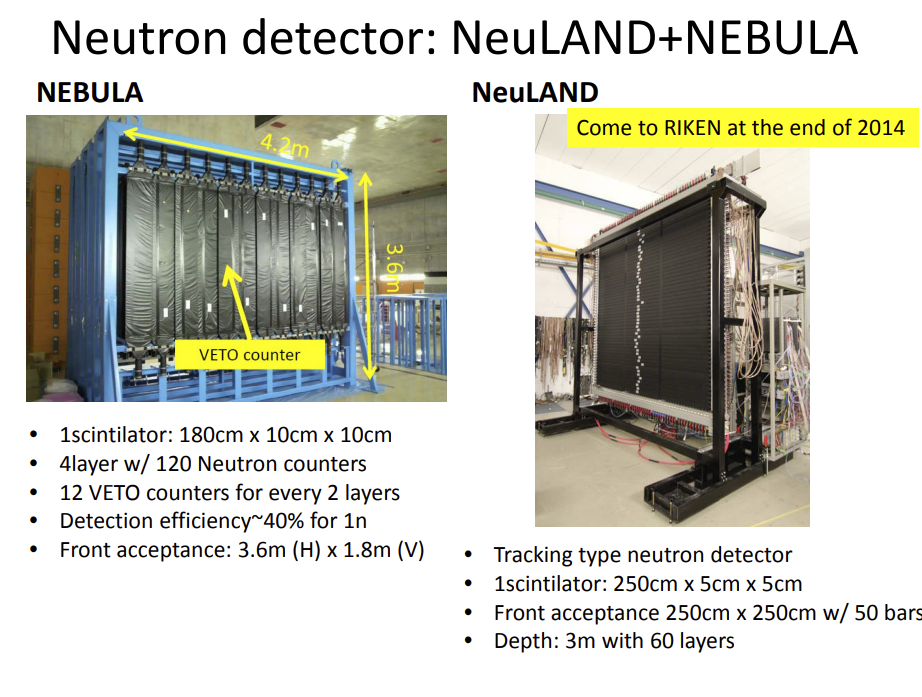

# Progress Report: Optimization of dpol_breakup Experiment Configuration

**Date:** November 26, 2025  
**To:** Mizuki, Aki  
**Subject:** Progress on Simulation Framework and Configuration Optimization

---

## 1. Objective
The primary goal is to determine the optimal experimental configuration for the `dpol_breakup` experiment by evaluating detection efficiency and reconstruction accuracy under various setups.

## 2. System Architecture & Data Flow
We have established a complete simulation and analysis framework with the following pipeline:

1. QMD Raw Data

    (apply physical cuts, sampling, and export for simulation)

2. Geant4 Input

    (convert sampled QMD to ROOT/macros; configure target, beam, and detector geometry)

3. Geant4 Simulation

    (run macros, collect hit/energy-deposit trees and output ROOT files)

4. PDC Analysis (Reconstruction)

    (perform PDC hit reconstruction, back-propagate tracks, and fit momentum)

*   **Scripts**: Developed for QMD data transformation, cutting, sampling, and reconstruction analysis (supporting both 3D visualization and batch processing).
*   **Status**: The core framework is operational and ready for optimization testing.

## 3. Performance Benchmarks
*   **Geant4 Simulation**: ~120 events/s.
*   **PDC Reconstruction**: ~0.05 - 1 events/s. （use Tminut to reconstruc proton P value）
    *   *Note*: The reconstruction speed is currently a bottleneck and is a primary focus for optimization.  The performance is also not good for some events

## 4. Detailed Progress

### 4.1. QMD Data Processing
*   **Challenge**: The raw data volume is excessive (approx. $2 \times 10^6$ events per target/gamma configuration).
*   **Action**: Applied physical cuts to focus on the region of interest and reduce data volume.
    *   **Momentum Cuts**: $|p_{y,p} - p_{y,n}| < 150$ and $(p_{x,p} + p_{x,n}) < 200$.
    *   **Angular Cuts**: $|\pi - |\phi_{rotation}|| < 0.2$.
    *   **Result**: Data volume reduced to $\sim 3 \times 10^4$ events, significantly improving processing feasibility.
*   **Next Step**: Implement systematic data sampling.

### 4.2. Geant4 Simulation

<figure>
    
    <figcaption>Figure Accumulated 5000 events</figcaption>
</figure>

*   **Goal**: Evaluate detection efficiency across various configurations.
*   **Current Setup**: Target position is configured based on a $5^{\circ}$ beam deflection in a 1.2 T magnetic field.
*   **Plan**: Generate multiple candidate macros with varying magnetic field values and target positions (aligned with PDC positions) to scan the parameter space.

<figure>
    
    <figcaption>
        Detection efficiency (an event is counted as detected if it records any energy deposit in the Geant4 tree). Macro: beam rotated by 5° in a 1.2 T magnetic field. Deuteron initial coordinates are fixed at x' = b(), y' = 0, z' = 0 (z is not randomized).
    </figcaption>
</figure>

来自论文的 探测器效率

来自某个slides的报告

### 4.3. PDC Analysis & Reconstruction （trans geant data to n/p momentum）

*   **Methodology**: Since the PDC primarily determines the particle direction, the reconstruction algorithm optimizes the **momentum magnitude** by minimizing the distance between the back-propagated track and the known target position.
*   **Algorithms Implemented**:
    1.  **Grid Search**: Robust global search but computationally expensive.
    2.  **Gradient Descent**: Fast but sensitive to local minima and noise.
    3.  **TMinuit (ROOT)**: Currently the primary method (using MIGRAD/SIMPLEX algorithms).
*   **Current Issues**:
    *   **Reconstruction Quality**: While many events are reconstructed correctly, a subset shows poor results.
    *   **Momentum Bias**: Analysis of momentum residuals ($\Delta p = p_{reco} - p_{true}$) reveals a **double-peak structure**:
        *   Peak 1: Around 0 (Correct reconstruction).
        *   Peak 2: Around -200 MeV/c (Systematic underestimation).
*   **Optimization Focus**:
    *   Tuning the Runge-Kutta (RK) stepping for charged particle motion in the magnetic field to balance precision and speed.
    *   Refining TMinuit convergence criteria to avoid local minima.

## 5. Optimization Strategy
To address the low reconstruction speed (currently ~0.1 Hz) and accuracy issues, the following strategies are being implemented:

1.  **Algorithm Optimization**: Adjusting the track calculation step size and magnetic field integration precision.
2.  **Batch Processing**: Implementing memory-efficient batch analysis by discarding unnecessary track objects during I/O.
3.  **Parallel Computing**: Enabling multi-threading to process multiple events simultaneously.
4.  **I/O Optimization**: Using asynchronous logging to prevent I/O blocking.

## 6. Next Steps (To-Do)

1.  **Data Generation**: Complete QMD data sampling and generate final ROOT files for Geant4 input.
2.  **Performance Tuning**: Continue optimizing the Geant4 simulation and reconstruction code for speed.
3.  **Configuration Study**: Systematically test different target positions corresponding to various magnetic fields and beam deflection angles.
4.  **Physics Analysis**: Investigate isovector effects in deuteron simulations.

## code detail

### qmd data sampling

nothing yet

### geant4

nothing

### pdc ana (and nebula)  reconstruction

 PDC Analysis Methodology
The PDC (Position Detector Chamber) analysis reconstructs particle hit positions from two drift chambers using a Center-of-Mass (CoM) weighted energy deposition method: PDCSimAna.cc:177-202

The reconstruction:

Processes U and V layer hits independently
Applies Gaussian position smearing for detector resolution
Reconstructs 3D positions at PDC1 and PDC2
Transforms coordinates accounting for spectrometer rotation angle PDCSimAna.hh:22-61

Runge-Kutta Integration (Core Physics Engine)
The trajectory calculation uses 4th-order Runge-Kutta integration for solving particle motion in magnetic fields: ParticleTrajectory.cc:159-206

Physics implementation:

Relativistic kinematics: E = √(p² + m²)
Lorentz force: dp/dt = q(v × B)
Step size: typically 1 mm
Physics constant: 89.87551787 for unit conversion (line 141) ParticleTrajectory.cc:120-157
4. NEBULA Neutron Reconstruction
For neutral particles (neutrons), a completely different approach is used: NEBULAReconstructor.cc:203-271

Methodology:

Time-of-flight (TOF) based reconstruction (no magnetic field effect)
Energy-weighted position clustering
Time window clustering (default 10 ns)
Energy threshold filtering (default 1 MeV)
Beta calculation: β = (flight distance / flight time) / c
Kinetic energy: KE = (γ - 1) × m_neutron