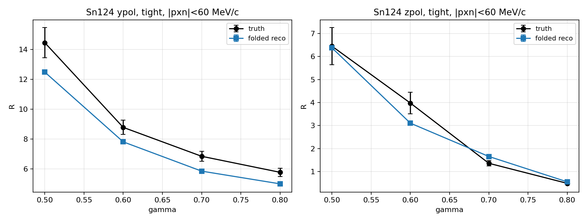
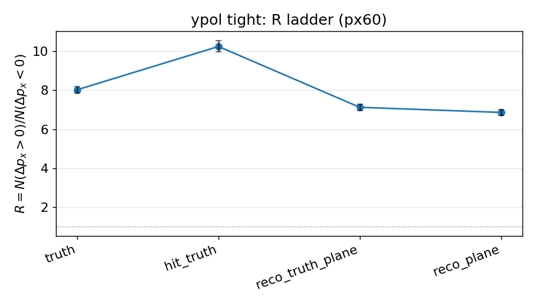
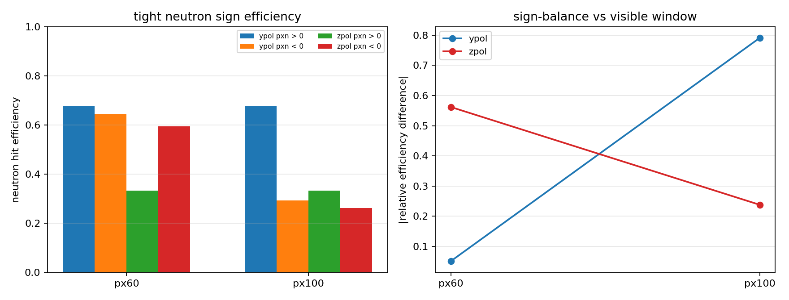
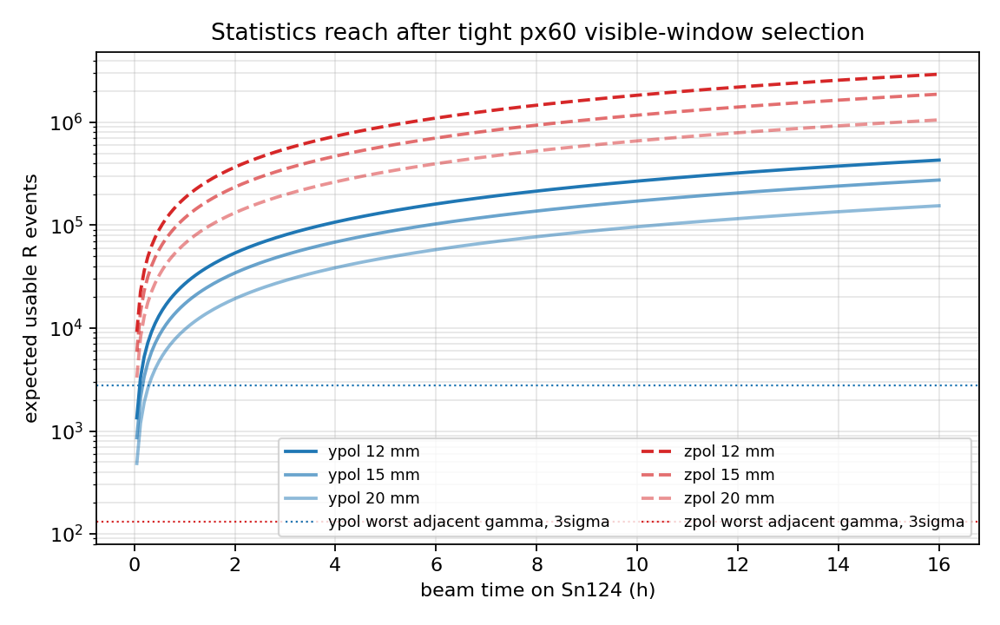

# 190 MeV/u 极化氘核破裂实验对 gamma 约束的当前可行性评估

日期: 2026-06-11

数据口径:

- 本地代码仓库: `/home/tian/workspace/dpol/smsimulator5.5`
- NEBULA-Plus 重建样本: `/home/tian/workspace/sshDir/spana03/Dpol_smsimulator/data/reconstruction/nebulaplus_nn_joint_20260609_012854`
- folding 诊断表: `checks/observables/folding_diagnostics/`
- 关键报告图: `docs/reports/gamma_constraint_20260611/figures/`

## 结论先行

当前样本支持下面这个说法:

1. 以 Sn124 为主靶时，`tight + |p_{x,n}| < 60 MeV/c` 的 folded visible-window observable 仍然保留明显的 gamma 依赖。ypol 中 folded reco 的 R 从 gamma=0.5 到 0.8 约 `12.48 -> 4.99`；zpol 约 `6.38 -> 0.56`。
2. 在 15 mm 直径 Sn124 靶、1.2 g 库存、`1e7 pps`、16 h 的 planning anchor 下，即使用当前模拟给出的保守 usable-event survival，ypol 仍约有 `2.75e5` 个可用 R 事件，zpol 约 `1.88e6` 个。
3. 当前模型点之间最难分开的相邻 gamma 间隔是 ypol 的 `g070 -> g080`，按纯统计 3 sigma 只需要约 `2.8e3` 个 usable R 事件。统计量不是主要瓶颈。
4. 主要风险不是统计，而是 detector folding 的系统误差: neutron acceptance 对相空间有强选择性，truth R 和 reco R 不是同一个物理量。当前最稳的路线是把每个理论 gamma 都通过同一套 Geant4 + reconstruction chain folding 后再和实验数据比较。
5. PDC 几何按最终生效配置处理: `3deg1.15Tnebulaplus.mac` 在执行基础几何后显式设置 `/samurai/geometry/PDC/Angle 69 deg` 并 `Update`。日志里的 65 deg 是前序设置，后续被 69 deg 覆盖。

## 1. Observable 和物理逻辑

目标是用极化氘核在靶附近受到的 p/n isovector force difference，观察 breakup 后 p/n 相对动量在反应平面中的偏置。每个事件先定义横向总动量方向:

```text
phi = atan2(p_y,p + p_y,n, p_x,p + p_x,n)
```

把 p 和 n 的动量旋转到该 event plane 后，定义:

```text
Delta p_x = p_x,p^rot - p_x,n^rot
R = N(Delta p_x > 0) / N(Delta p_x < 0)
```

实验中可直接测到的是 folded observable:

```text
N_reco(j) = sum_i K(j|i) N_true(i) + b(j)
```

这里 `K` 包含 NEBULA/NEBULA-Plus acceptance、分辨率、重建效率、PDC proton reconstruction、reaction-plane migration 和 cuts。因此一般有:

```text
R_reco != R_truth
```

报告里的判断不把 `R_reco` 直接解释为 truth-level R，而是看同一 folded 口径下 `R(gamma)` 是否足够分开。

## 2. 当前最有说服力的 gamma 敏感性



Sn124, `tight + |p_{x,n}| < 60 MeV/c`, folded reco plane:

| pol | gamma | N_sim | R_folded |
| --- | ---: | ---: | ---: |
| ypol | 0.5 | 2305 | 12.48 |
| ypol | 0.6 | 2422 | 7.81 |
| ypol | 0.7 | 2451 | 5.85 |
| ypol | 0.8 | 2338 | 4.99 |
| zpol | 0.5 | 354 | 6.38 |
| zpol | 0.6 | 275 | 3.10 |
| zpol | 0.7 | 343 | 1.66 |
| zpol | 0.8 | 478 | 0.56 |

这个图的重点不是 truth 和 reco 完全一致，而是 folded reco 曲线本身仍然随 gamma 单调变化，并且间隔远大于 16 h beamtime 下的统计误差。

## 3. Detector folding 对 R 的影响

### 3.1 ypol tight px60 的 R ladder



pooled ypol tight px60:

| stage | N | N_pos | N_neg | R |
| --- | ---: | ---: | ---: | ---: |
| truth | 24323 | 21626 | 2697 | 8.02 |
| hit_truth | 15751 | 14349 | 1402 | 10.23 |
| reco_truth_plane | 16509 | 14476 | 2033 | 7.12 |
| reco_plane | 16509 | 14408 | 2101 | 6.86 |

解释:

- `hit_truth` 相对 `truth` 发生变化，说明 neutron hit acceptance 已经改变 R。
- `reco_truth_plane -> reco_plane` 的变化较小，说明 reaction-plane reconstruction 不是最大问题。
- 主要 detector folding 来自 neutron visible window 和效率，而不是 proton NN reconstruction。

### 3.2 px60 是目前比 px100 更干净的工作口径



ypol tight 的 neutron hit efficiency:

| fiducial | eps(pxn>0) | eps(pxn<0) | relative difference |
| --- | ---: | ---: | ---: |
| px60 | 0.678 | 0.644 | 0.050 |
| px100 | 0.677 | 0.293 | 0.791 |

所以 `px100` 会保留一个 NEBULA 很难看到的负 `p_{x,n}` 分支，导致 R 被 detector efficiency 强烈扭曲。`px60` 不是消除所有 detector effect，而是把最严重的 sign-dependent efficiency 降到可建模、可做 closure test 的范围。

### 3.3 sign migration 本身可控

ypol tight px60 的 `Delta p_x` sign migration:

| truth sign | P(reco negative) | P(reco positive) |
| --- | ---: | ---: |
| negative | 0.954 | 0.046 |
| positive | 0.00265 | 0.997 |

这说明在已经进入 visible window 的事件中，`Delta p_x` 符号翻转不是主导误差。主导误差仍是哪些 neutron kinematics 能被探测到。

## 4. 统计量和束流时间

当前 beamtime planning anchor:

- beam energy: 190 MeV/u
- beam intensity: `1.0e7 pps`
- SRC harmonic: 6
- bunch spacing: `33.62 ns`
- planning breakup cross section: `550 mb`
- planning detected-coincidence efficiency: `4.65%`

Sn124 1.2 g 库存下的 15 mm 圆盘:

- 等效厚度: `0.929 mm`
- detected coincidence rate: `843 Hz`
- 16 h detected coincidences: `4.86e7`

用当前 full simulation 的保守 usable-event survival 继续折算:

| pol | useful fraction | 16 h usable R events | worst adjacent-gamma 3 sigma N |
| --- | ---: | ---: | ---: |
| ypol | 0.00566 | 2.75e5 | 2.77e3 |
| zpol | 0.03869 | 1.88e6 | 1.31e2 |



即使采用 20 mm 圆盘、同样 1.2 g 库存，16 h 后 ypol usable R events 仍在 `1e5` 量级以上。统计上可以做 gamma 约束；最终误差预算会由 detector response、neutron efficiency 和理论模型 folding 误差控制。

pile-up 方面，旧 planning 的 3 mm reference thickness 下每 bucket detected coincidence mean 约 `9.16e-5`。15 mm 库存方案 rate 更低，因此 single-bucket pile-up 不是当前主瓶颈。仍需检查电子学积分窗是否跨多个 bucket。

## 5. 建议的 gamma 约束流程

推荐主线:

1. 对每个 gamma 的 QMD 输出，跑同一套 Geant4 几何、NEBULA-Plus detector response、PDC NN proton reconstruction、neutron reconstruction。
2. 用同一 selection 定义实验和模型的 folded observable: `tight + |p_{x,n}^{reco}| < 60 MeV/c`，优先使用 Sn124。
3. 对实验数据构造:

```text
R_exp = N(Delta p_x^reco > 0) / N(Delta p_x^reco < 0)
```

4. 对模型构造:

```text
R_model_folded(gamma)
```

5. 用 likelihood 或 chi-square 做约束:

```text
chi2(gamma) =
  [R_exp - R_model_folded(gamma)]^2 /
  [sigma_stat^2 + sigma_detector^2 + sigma_model^2]
```

6. 组合 ypol/zpol 和 Sn112/Sn124 时，要先确认每个通道的 folding closure 和系统误差，不要只按统计误差合并。

这一路线的优点是避免不稳定 unfolding。只有在 closure test 证明 response matrix 可逆、效率没有近零区域主导时，再把 unfolded truth-level R 作为附加结果。

## 6. 还缺什么

当前不能过度宣称的部分:

- `eta_coin = 4.65%` 仍是 manuscript planning anchor。本地 selected-breakup validation 可复现的是约 `37.9%` acceptance，两者口径不同，proposal 里必须写清楚。
- Sn112/Sn124 的 target-specific breakup cross section 仍需要用统一 ImQMD shell integration 抽取，而不是只用 Sn124 anchor 平移。
- 还没有真实实验的 neutron efficiency calibration、time offset、threshold、cross-talk、fake neutron 和 accidental background。
- detector response 的系统误差还没有通过 toy closure 或 pseudo-data closure 量化。
- 当前报告使用的是 simulation truth-defined cuts 和 reco-defined visible window的混合诊断；最终实验分析要把所有实验端 cuts 写成 reco-only 版本，并用 simulation 做 truth 对照。

## 7. 当前推荐给 proposal/报告的说法

可以写:

> 在 Sn124 上，经过 NEBULA-Plus detector response、PDC NN proton reconstruction 和 neutron reconstruction 后，`tight + |p_{x,n}|<60 MeV/c` 的 folded R observable 仍保留强 gamma 依赖。按当前 15 mm/1.2 g Sn target、`1e7 pps`、16 h planning，统计量比相邻 gamma 点 3 sigma 区分所需事件数高两个数量级以上。因此实验对 gamma 的约束可行性主要取决于 detector folding 的系统控制，而不是统计量。

不应该写:

> reco R 已经等于 truth R。

更准确的表述是:

> 实验应比较 folded data 与 folded model；truth-level R 只作为物理解释和 closure-test 参考。
