# 190 MeV/u 极化氘核破裂实验对 gamma 约束的当前可行性评估

日期: 2026-06-11

数据口径:

- 本地代码仓库: `/home/tian/workspace/dpol/smsimulator5.5`
- NEBULA-Plus 重建样本: `/home/tian/workspace/sshDir/spana03/Dpol_smsimulator/data/reconstruction/nebulaplus_nn_joint_20260609_012854`
- folding 诊断表: `checks/observables/folding_diagnostics/`
- 关键报告图: `docs/reports/gamma_constraint_20260611/figures/`

**数据溯源**（三级流水线，所有图表基于同一套样本）：
1. QMD 模拟: d+Sn 190 MeV/u, γ={0.5,0.6,0.7,0.8}, 靶 Sn112+Sn124, ypol (phi_random) + zpol (b_discrete)
2. breakup 提取: `breakup_nn_targetframe_20260607_180428` (2026-06-07 18:04)
3. NEBULA-Plus + PDC NN joint 重建: `nebulaplus_nn_joint_20260609_012854` (2026-06-09 01:28)

所有图表脚本（`make_cut_diagnostics_figures.py`、`plot_nebulaplus_reco.py`）用 uproot 直接读 ③ 的 176 个 `*_reco.root` 文件（`recoTree`），过滤 `truth_has_proton & truth_has_neutron & nn_status==0`。Sn124 事件数: ypol 1.68e6（16 文件），zpol 3.75e4（160 文件）。

## 结论先行

当前样本支持下面这个说法:

1. 以 Sn124 为主靶时，`tight + |p_{x,n}| < 60 MeV/c` 的 folded visible-window observable 仍然保留明显的 gamma 依赖。ypol 中 folded reco 的 R 从 gamma=0.5 到 0.8 约 `12.48 -> 4.99`；zpol 约 `6.38 -> 0.56`。
2. 在 15 mm 直径 Sn124 靶、1.2 g 库存、`1e7 pps`、16 h 的 planning anchor 下，即使用当前模拟给出的保守 usable-event survival，ypol 仍约有 `2.75e5` 个可用 R 事件，zpol 约 `1.88e6` 个。
3. 当前模型点之间最难分开的相邻 gamma 间隔是 ypol 的 `g070 -> g080`，按纯统计 3 sigma 只需要约 `2.8e3` 个 usable R 事件。统计量不是主要瓶颈。
4. 主要风险不是统计，而是 detector folding 的系统误差: neutron acceptance 对相空间有强选择性，truth R 和 reco R 不是同一个物理量。当前最稳的路线是把每个理论 gamma 都通过同一套 Geant4 + reconstruction chain folding 后再和实验数据比较。
5. PDC 几何按最终生效配置处理: `3deg1.15Tnebulaplus.mac` 在执行基础几何后显式设置 `/samurai/geometry/PDC/Angle 69 deg` 并 `Update`。日志里的 65 deg 是前序设置，后续被 69 deg 覆盖。

## 1. Observable 和物理逻辑

目标是用极化氘核在靶附近受到的 p/n isovector force difference，观察 breakup 后 p/n 相对动量在反应平面中的偏置。每个事件先定义横向总动量方向:

```text
phi = atan2(p_y,p + p_y,n, p_x,p + p_x,n)
```

把 p 和 n 的动量旋转到该 event plane 后，定义:

```text
Delta p_x = p_x,p^rot - p_x,n^rot
R = N(Delta p_x > 0) / N(Delta p_x < 0)
```

实验中可直接测到的是 folded observable:

```text
N_reco(j) = sum_i K(j|i) N_true(i) + b(j)
```

这里 `K` 包含 NEBULA/NEBULA-Plus acceptance、分辨率、重建效率、PDC proton reconstruction、reaction-plane migration 和 cuts。因此一般有:

```text
R_reco != R_truth
```

报告里的判断不把 `R_reco` 直接解释为 truth-level R，而是看同一 folded 口径下 `R(gamma)` 是否足够分开。

## 2. 当前最有说服力的 gamma 敏感性


Sn124, `tight + |p_{x,n}| < 60 MeV/c`, folded reco plane:

| pol | γ | N+ | N− | R_folded | σ(R) sim | σ(R) 16h |
| --- | --- | ---: | ---: | ---: | ---: | ---: |
| ypol | 0.5 | 2134 | 171 | 12.48 | 0.99 | 0.091 |
| ypol | 0.6 | 2147 | 275 | 7.81 | 0.50 | 0.047 |
| ypol | 0.7 | 2093 | 358 | 5.85 | 0.33 | 0.032 |
| ypol | 0.8 | 1948 | 390 | 4.99 | 0.28 | 0.026 |
| zpol | 0.5 | 306 | 48 | 6.38 | 0.99 | 0.014 |
| zpol | 0.6 | 208 | 67 | 3.10 | 0.44 | 0.005 |
| zpol | 0.7 | 214 | 129 | 1.66 | 0.18 | 0.0025 |
| zpol | 0.8 | 171 | 307 | 0.56 | 0.053 | 0.0008 |

N+/N− 是 Δpx^reco 正/负的事例数；σ(R) sim 是当前 MC 样本的统计误差；σ(R) 16h 是外推到 16 h 束流后的统计误差（公式见 §5）。

这个图的重点不是 truth 和 reco 完全一致，而是 folded reco 曲线本身仍然随 gamma 单调变化，并且间隔远大于 16 h beamtime 下的统计误差。

## 3. Detector folding 对 R 的影响

### 3.1 ypol tight px60 的 R ladder


pooled ypol tight px60:

| stage | N | N_pos | N_neg | R |
| --- | ---: | ---: | ---: | ---: |
| truth | 24323 | 21626 | 2697 | 8.02 |
| hit_truth | 15751 | 14349 | 1402 | 10.23 |
| reco_truth_plane | 16509 | 14476 | 2033 | 7.12 |
| reco_plane | 16509 | 14408 | 2101 | 6.86 |

解释:

- `hit_truth` 相对 `truth` 发生变化，说明 neutron hit acceptance 已经改变 R。
- `reco_truth_plane -> reco_plane` 的变化较小，说明 reaction-plane reconstruction 不是最大问题。
- 主要 detector folding 来自 neutron visible window 和效率，而不是 proton NN reconstruction。

### 3.2 px60 是目前比 px100 更干净的工作口径


ypol tight 的 neutron hit efficiency:

| fiducial | eps(pxn>0) | eps(pxn<0) | relative difference |
| --- | ---: | ---: | ---: |
| px60 | 0.678 | 0.644 | 0.050 |
| px100 | 0.677 | 0.293 | 0.791 |

所以 `px100` 会保留一个 NEBULA 很难看到的负 `p_{x,n}` 分支，导致 R 被 detector efficiency 强烈扭曲。`px60` 不是消除所有 detector effect，而是把最严重的 sign-dependent efficiency 降到可建模、可做 closure test 的范围。

### 3.3 sign migration 本身可控

ypol tight px60 的 `Delta p_x` sign migration。sign migration 定义为条件概率 **P(reco sign | truth sign)**，其中 truth sign = sgn(Δpx^truth)、reco sign = sgn(Δpx^reco)；对角元素 (truth→同号) 是保持率，非对角元素 (truth→反号) 是翻转率：

| truth sign | P(reco negative) | P(reco positive) |
| --- | ---: | ---: |
| negative | 0.954 | 0.046 |
| positive | 0.00265 | 0.997 |

这说明在已经进入 visible window 的事件中，`Delta p_x` 符号翻转不是主导误差。主导误差仍是哪些 neutron kinematics 能被探测到。

## 4. Cut 系统诊断

实验观察量依赖两套选择：事件选择 (`loose/mid/tight`) 和中子可见窗 (`|pxn| < 60/80/100 MeV/c`)。下面用直接从 ROOT 读取的事件级数据 (`make_cut_diagnostics_figures.py`，复用 `plot_nebulaplus_reco.py` 的 loader 和 cut 定义) 展示这两套 cut 怎么改变观察量和相空间覆盖。

**Cut 定义**（基于 truth 动量，见 `compute_cut_masks`；记 Σ 为 p+n 求和、φ_Σ = atan2(py,Σ, px,Σ)）：
- ypol — `loose`: |py,p−py,n|<150 且 |pT,Σ|>50；`mid`: 再加 |pT,Σ|<200；`tight`: 再加共线 (π−|φ_Σ|)<0.2。
- zpol — `loose`: (pz,p+pz,n)>1150 且 |pz,p−pz,n|<150；`mid`: 再加 |px,Σ|<200 且 |pT,Σ|>50；`tight`: 再加 (π−|φ_Σ|)<0.5。

### 4.1 R(γ) 在 9 组 cut 下的全貌

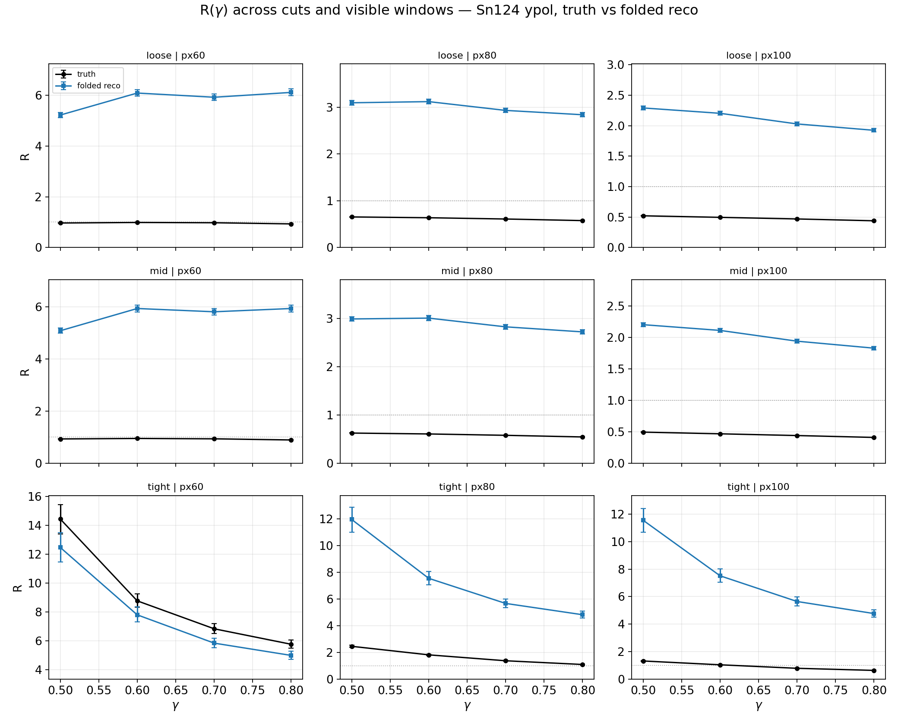

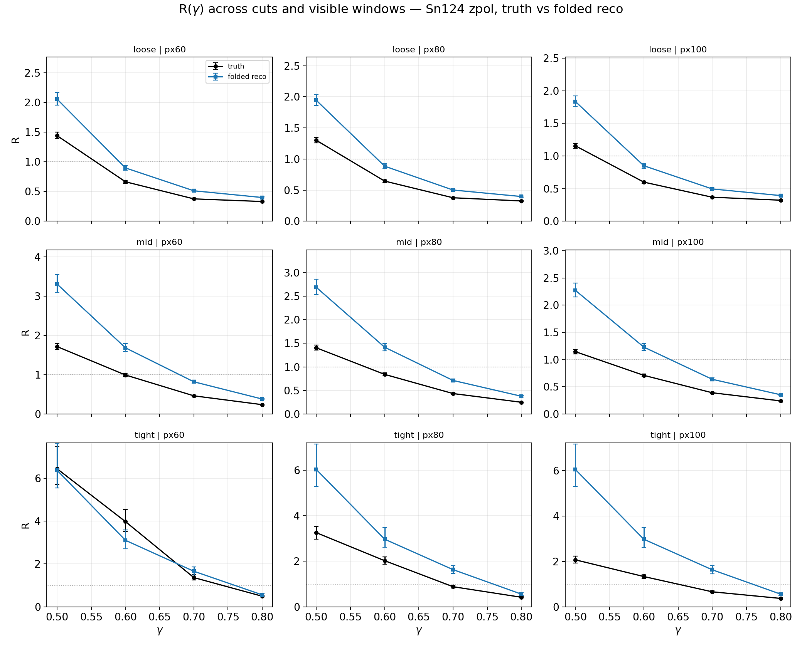

每张图是 3×3 网格（行 = loose/mid/tight，列 = px60/px80/px100）。黑点 = truth-level R，蓝点 = folded reco R，都带 bootstrap 误差棒。要点：

- `loose`→`tight` 使 ypol 的 R 单调上升、zpol 的 R 单调下降（事件选择越来越偏向某一符号）。
- px60→px100 使 R 增大，因为更大的 visible window 保留了更多 NEBULA 看不到的负 pxn 分支（见 §3.2）。
- reco 与 truth 的 gap 在 tight px60 最小。
- γ 敏感性（曲线斜率）在全部 9 组里都保留，但 tight px60 的 truth/reco 一致性最好。

### 4.2 Δpx 的形状：truth vs reco

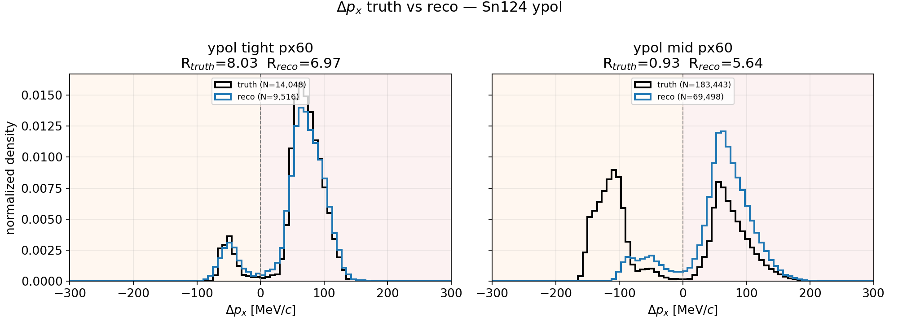

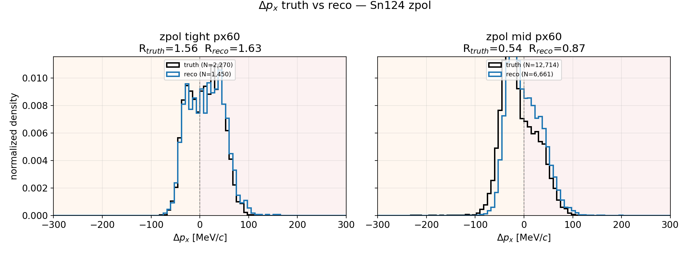

归一化 Δpx 直方图：黑色 = **truth**（truth 事件面 + truth 动量），蓝色 = **reco**（reco 事件面 + NN 质子 + reconstructed 中子）。红色背景 = Δpx>0（R 分子），橙色 = Δpx<0（R 分母）。tight px60 和 mid px60 并排，图标题里同时给出 R_truth 和 R_reco。

要点：reco 分布的峰位和宽度与 truth 接近，符号迁移主要发生在尾部；ypol 的不对称性（正侧远大于负侧）在 truth 和 reco 里都清楚可见。

### 4.3 相空间覆盖（truth level）

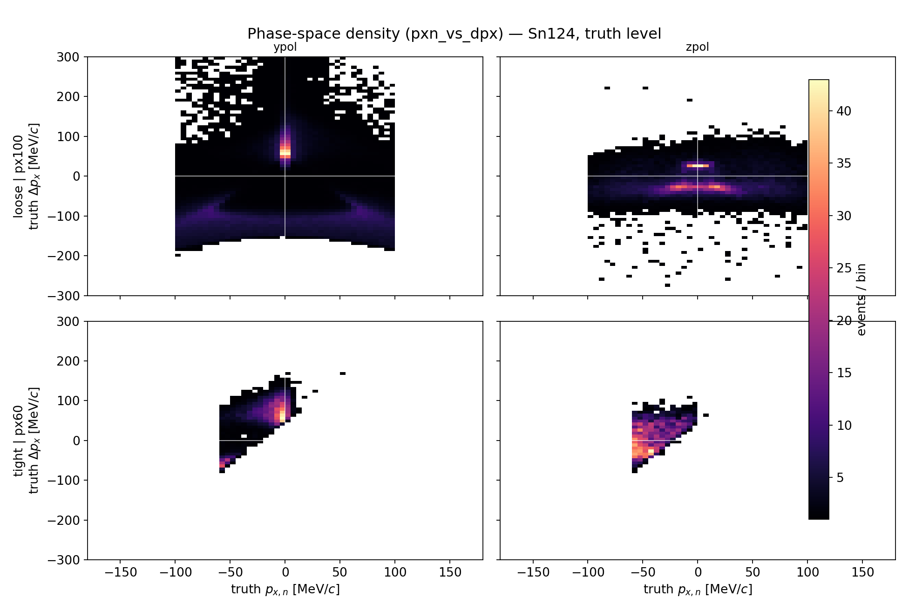

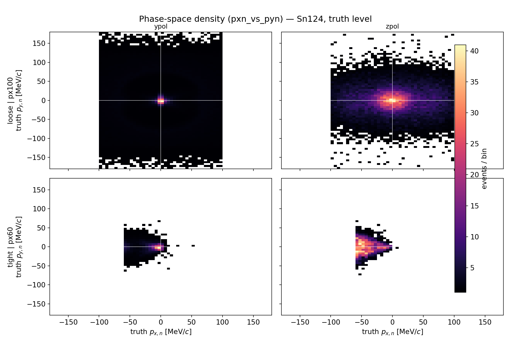

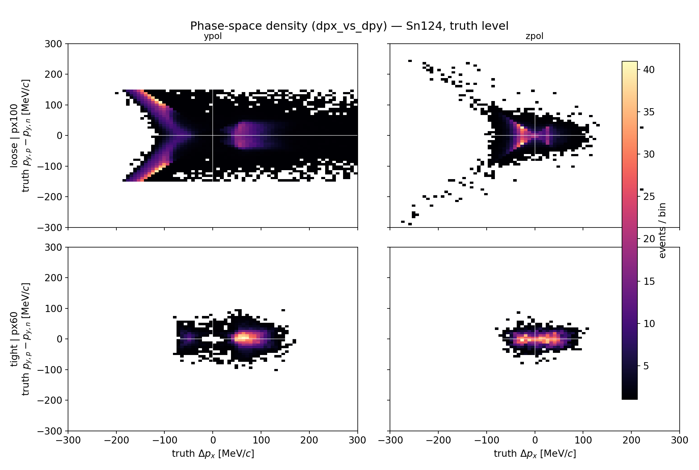

这三张是 **truth-level 相空间密度**（事件计数/格，不是效率）。上排 = loose px100，下排 = tight px60，列 = ypol/zpol。它们回答的是"这套 cut 在 truth 相空间里选了哪一块区域"：

- pxn-vs-Δpx：tight px60 把中子 |pxn|<60 的窄条切出来，Δpx 集中在正值侧（ypol）。
- pxn-vs-pyn：tight 选择显著压缩横向动量覆盖。
- Δpx-vs-Δpy：tight 把事件压到反应面附近（Δpy→0）。

注意：这里是 **truth 相空间**，不是 reco 后的。reco-level 的 truth→reco 迁移是另一个问题，由 §3 的 response matrix 覆盖——本节看的是 cut 的几何选择，不是探测器 smearing。

### 4.4 不同 cut 下的 neutron efficiency

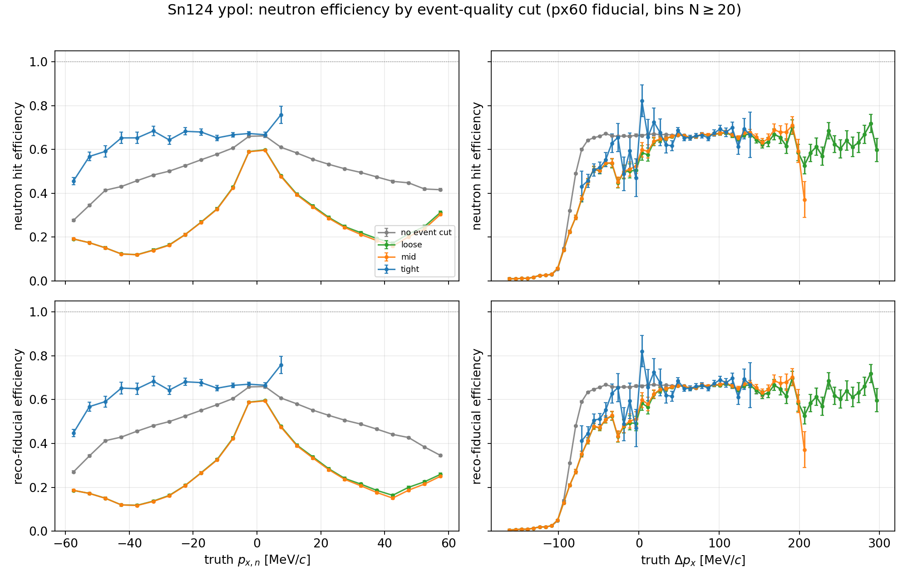

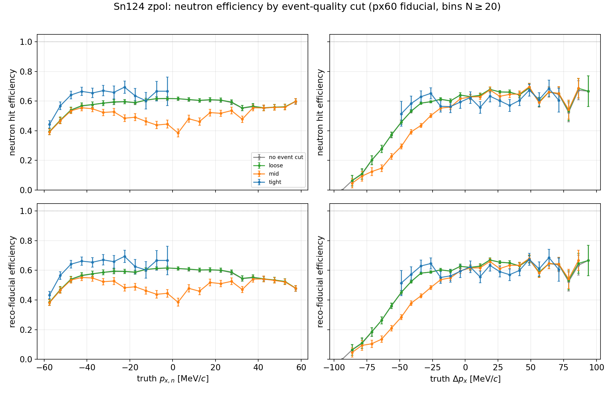

四条曲线 = none（无事件选择）/ loose / mid / tight，全部使用 px60 truth fiducial。上排 = neutron hit efficiency，下排 = reco-fiducial efficiency；左列 vs truth pxn，右列 vs truth Δpx。效率定义为 ε(x) = N_hit(x-bin) / N_fid(x-bin)，只画 N_fid ≥ 20 的 bin。

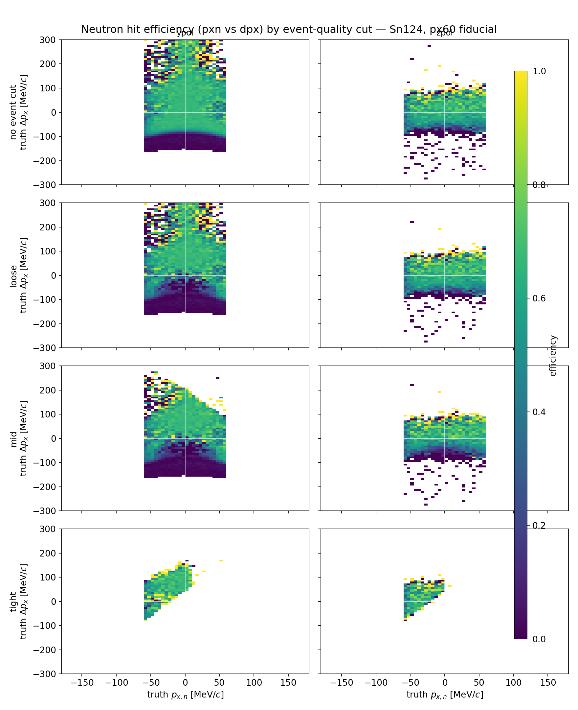

二维 neutron hit efficiency 热图（pxn vs Δpx），按 event-quality cut 分行（none/loose/mid/tight），列为 ypol/zpol。

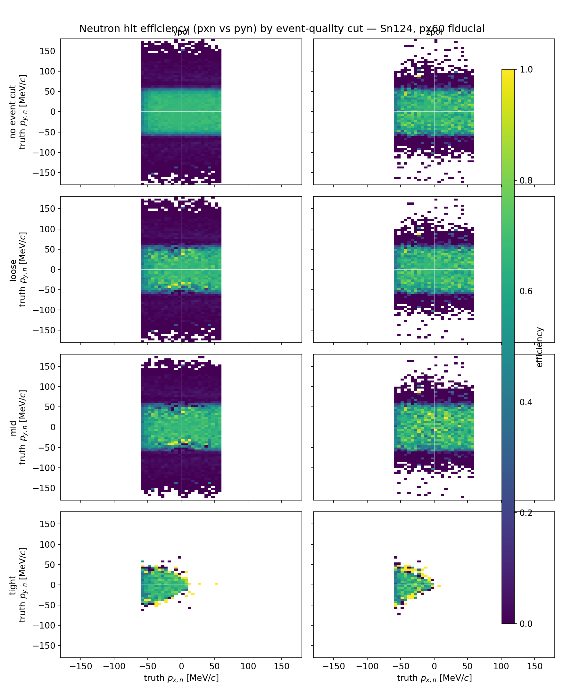

同上，pxn vs pyn（中子横向平面）。从 none 到 tight 高效率区形状基本不变——cut 改变的是采样的相空间区域，不是单 bin 效率。

要点：从 none 到 tight，效率曲线的形状基本一致（核心区 ε~0.55–0.70），说明 event-quality cut 主要改变的是进入样本的相空间区域（哪些 pxn/Δpx 的 bin 有足够统计），而不是单 bin 内的探测效率本身。效率对 pxn 符号的依赖（ypol 中负 pxn 侧效率偏低）在 none 和 tight 下都存在——这是 NEBULA 几何的固有特征，cut 无法消除，只能通过缩小 visible window（px60）把最严重的 sign-dependent 区域排除。

### 4.5 无 px fiducial 的 neutron efficiency（全范围）

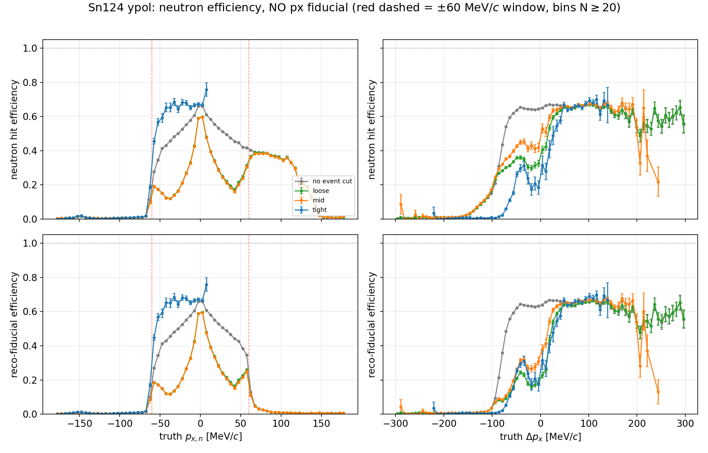

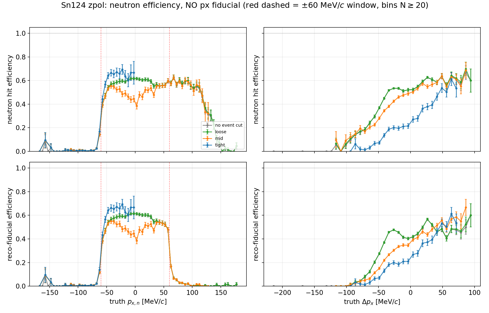

去掉 px fiducial 后的全范围效率曲线。红色虚线 = ±60 MeV/c（px60 窗口边界）。四条曲线同前（none/loose/mid/tight）。

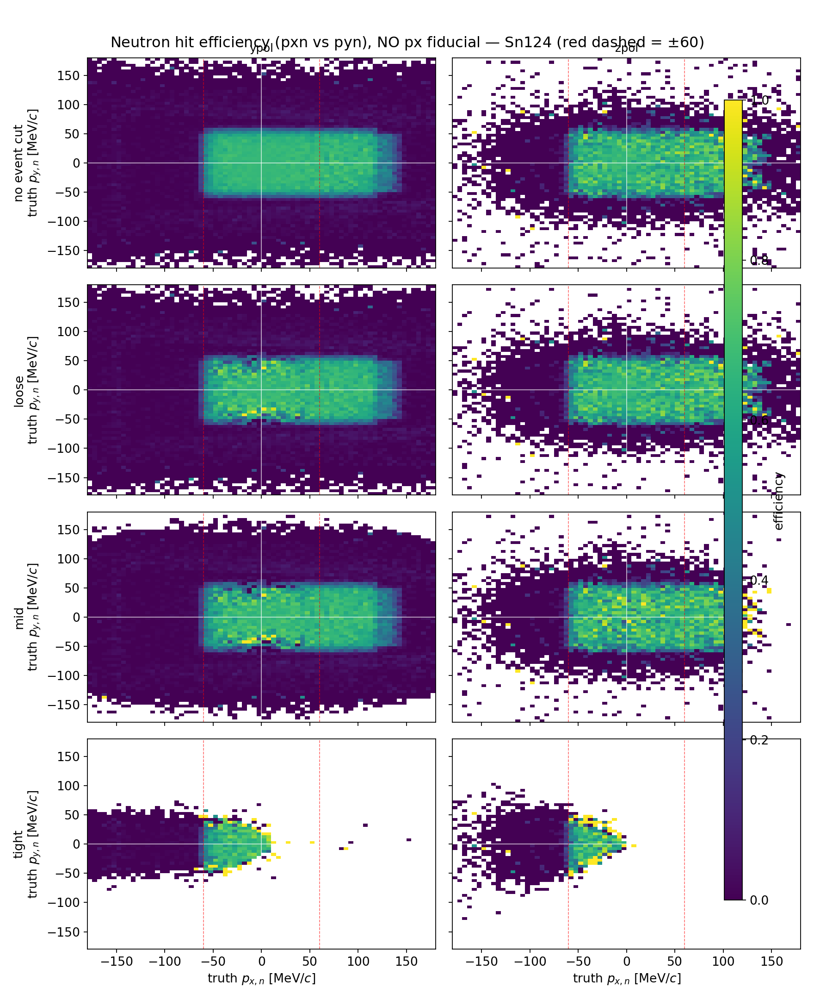

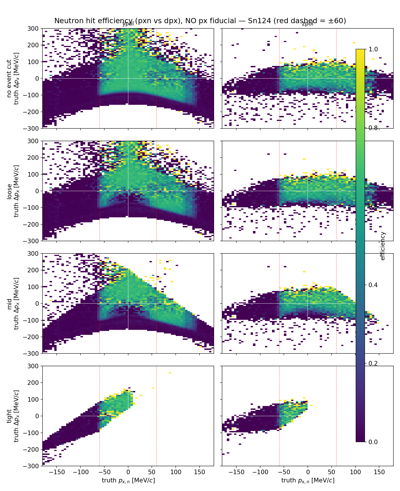

无 px fiducial 的 2D neutron hit efficiency 热图，按 event-quality cut 分行。红色虚线 = ±60 MeV/c。

这组图回答的核心问题是：**为什么需要 px60 cut**。去掉 px fiducial 后可以看到完整的 neutron 效率景观——NEBULA 对正 pxn 侧效率较高（~0.6–0.7），但对负 pxn 且 |pxn|>60 的区域效率急剧下降（ypol）。这正是 px100 会保留一个 NEBULA 几乎看不到的负分支、从而扭曲 R 的物理原因。px60 把分析限制在两侧效率都 >0.5 的核心区域。

## 5. 统计量和束流时间

当前 beamtime planning anchor:

- beam energy: 190 MeV/u
- beam intensity: `1.0e7 pps`
- SRC harmonic: 6
- bunch spacing: `33.62 ns`
- planning breakup cross section: `550 mb`
- planning detected-coincidence efficiency: `4.65%`

Sn124 1.2 g 库存下的 15 mm 圆盘:

- 等效厚度: `0.929 mm`
- detected coincidence rate: `843 Hz`
- 16 h detected coincidences: `4.86e7`

### 5.1 QMD 样本量与通过率

当前画图所用的 QMD 样本（Sn124，4 个 γ 点求和）在两个极化方向上极不均衡：

| pol | N_raw (QMD) | N_tight | N_reco(px60) | raw→tight | raw→reco |
| --- | ---: | ---: | ---: | ---: | ---: |
| ypol | 1.68e6 | 4.36e4 | 9.52e3 | 2.59% | 0.566% |
| zpol | 3.75e4 | 6.04e3 | 1.45e3 | 16.1% | 3.87% |

ypol 生成了 1.68e6 个 QMD 事例，zpol 只有 3.75e4 个（相差 45 倍）。zpol 的通过率更高（16.1% vs 2.59%），但 raw 样本太小，导致当前 zpol 图的 MC 统计误差偏大（σ(R)~0.05–0.99，见 §2 表）。N_reco 是当前 tight-px60 图实际使用的 usable R 事件数。

把实验 16 h 的 expected usable 事件和当前 MC 画图统计直接对比：

| pol | useful fraction | N_sim (当前图) | 16 h usable | 16 h / N_sim | worst 3σ N_req |
| --- | ---: | ---: | ---: | ---: | ---: |
| ypol | 0.00566 | 9.52e3 | 2.75e5 | ~29× | 2.77e3 |
| zpol | 0.03869 | 1.45e3 | 1.88e6 | ~1.3e3× | 1.31e2 |

16 h 束流下 ypol 的 usable 统计是当前图的 ~29 倍，zpol 是 ~1300 倍。useful fraction = N_reco/N_raw 把 detected coincidences 折算到 usable R 事件：N_usable = 4.86e7 × useful_fraction。zpol 的 ~1300 倍增益尤其关键：当前 zpol MC 严重欠采样（1.45e3 usable 事件），实验会大幅改善其精度。

### 5.2 统计误差推导

R = N+/N− 是比值统计量。在 N = N+ + N− 个有效事件的多项式模型下，用 delta method：

```text
σ(R) = (1+R) * sqrt(R / N)
```

相邻两个 γ 点 3σ 区分所需事件数（用两端均值 R̄ = ½(R1+R2) 估 σ）：

```text
N_required = [ zα · (1+R̄) · sqrt(R̄) / |ΔR| ]²,    zα = 3
```

对应 tight px60 folded reco 的逐间隔结果：

| pol | 间隔 | R_左 | R_右 | \|ΔR\| | N_req(3σ) |
| --- | --- | ---: | ---: | ---: | ---: |
| ypol | g050→g060 | 12.48 | 7.81 | 4.67 | 519 |
| ypol | g060→g070 | 7.81 | 5.85 | 1.96 | 979 |
| ypol | g070→g080 | 5.85 | 4.99 | 0.85 | 2.77e3 |
| zpol | g050→g060 | 6.38 | 3.10 | 3.27 | 131 |
| zpol | g060→g070 | 3.10 | 1.66 | 1.45 | 117 |
| zpol | g070→g080 | 1.66 | 0.56 | 1.10 | 36 |

最难区分的间隔：ypol g070→g080（R̄=5.42, |ΔR|=0.85，需 2.77e3 事件）；zpol 最难是 g050→g060（R̄=4.74, |ΔR|=3.27，需 131）。

useful-event 外推链：

```text
N_usable = rate × T × useful_fraction
useful_fraction = N_reco_plane(tight px60) / N_raw
```

ypol useful_fraction=0.00566 给 N_usable = 4.86e7 × 0.00566 ≈ 2.75e5；zpol useful_fraction=0.0387 给 1.88e6。可用量与所需量之比：ypol ≈ 99×（约两个数量级），zpol ≈ 1.4e4×（约四个数量级）。

### 5.3 统计 vs 系统对照

ypol tight px60 的三个量级放在一起：

| 量 | 典型值 |
| --- | --- |
| σ_stat(R) @ 16h（每个 γ 点） | 0.026 – 0.091 |
| ΔR_detector（truth→reco，每个 γ 点） | 1 – 2 |
| ΔR_between_gamma（最难间隔 g070→g080） | 0.85 |

16 h 统计误差（~0.03–0.09）比探测器 folding 造成的 R 偏移（~1–2）小一到两个量级，比最小 γ 间距（0.85）也小约一个量级。因此"统计不是瓶颈、系统主导"这一结论有定量支撑。


即使采用 20 mm 圆盘、同样 1.2 g 库存，16 h 后 ypol usable R events 仍在 `1e5` 量级以上。统计上可以做 gamma 约束；最终误差预算会由 detector response、neutron efficiency 和理论模型 folding 误差控制。

pile-up 方面，旧 planning 的 3 mm reference thickness 下每 bucket detected coincidence mean 约 `9.16e-5`。15 mm 库存方案 rate 更低，因此 single-bucket pile-up 不是当前主瓶颈。仍需检查电子学积分窗是否跨多个 bucket。

## 6. 建议的 gamma 约束流程

推荐主线:

1. 对每个 gamma 的 QMD 输出，跑同一套 Geant4 几何、NEBULA-Plus detector response、PDC NN proton reconstruction、neutron reconstruction。
2. 用同一 selection 定义实验和模型的 folded observable: `tight + |p_{x,n}^{reco}| < 60 MeV/c`，优先使用 Sn124。
3. 对实验数据构造:

```text
R_exp = N(Delta p_x^reco > 0) / N(Delta p_x^reco < 0)
```

4. 对模型构造:

```text
R_model_folded(gamma)
```

5. 用 likelihood 或 chi-square 做约束:

```text
chi2(gamma) =
  [R_exp - R_model_folded(gamma)]^2 /
  [sigma_stat^2 + sigma_detector^2 + sigma_model^2]
```

6. 组合 ypol/zpol 和 Sn112/Sn124 时，要先确认每个通道的 folding closure 和系统误差，不要只按统计误差合并。

这一路线的优点是避免不稳定 unfolding。只有在 closure test 证明 response matrix 可逆、效率没有近零区域主导时，再把 unfolded truth-level R 作为附加结果。

## 7. 还缺什么

当前不能过度宣称的部分:

- `eta_coin = 4.65%` 仍是 manuscript planning anchor。本地 selected-breakup validation 可复现的是约 `37.9%` acceptance，两者口径不同，proposal 里必须写清楚。
- Sn112/Sn124 的 target-specific breakup cross section 仍需要用统一 ImQMD shell integration 抽取，而不是只用 Sn124 anchor 平移。
- 还没有真实实验的 neutron efficiency calibration、time offset、threshold、cross-talk、fake neutron 和 accidental background。
- detector response 的系统误差还没有通过 toy closure 或 pseudo-data closure 量化。
- 当前报告使用的是 simulation truth-defined cuts 和 reco-defined visible window的混合诊断；最终实验分析要把所有实验端 cuts 写成 reco-only 版本，并用 simulation 做 truth 对照。

## 8. 当前推荐给 proposal/报告的说法

可以写:

> 在 Sn124 上，经过 NEBULA-Plus detector response、PDC NN proton reconstruction 和 neutron reconstruction 后，`tight + |p_{x,n}|<60 MeV/c` 的 folded R observable 仍保留强 gamma 依赖。按当前 15 mm/1.2 g Sn target、`1e7 pps`、16 h planning，统计量比相邻 gamma 点 3 sigma 区分所需事件数：ypol 高约两个数量级（~99×），zpol 高约四个数量级（~1.4e4×）。因此实验对 gamma 的约束可行性主要取决于 detector folding 的系统控制，而不是统计量。

不应该写:

> reco R 已经等于 truth R。

更准确的表述是:

> 实验应比较 folded data 与 folded model；truth-level R 只作为物理解释和 closure-test 参考。
