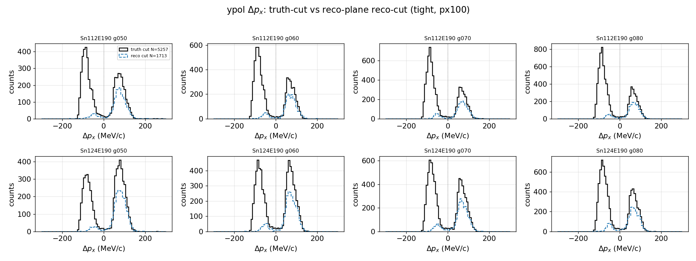
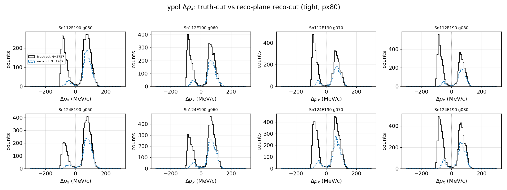
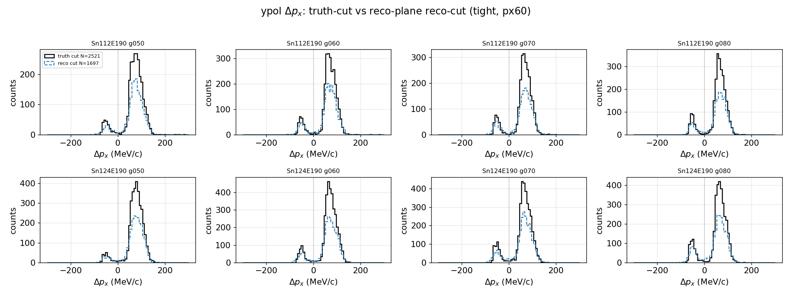

# NEBULA-Plus reconstruction: detector folding effect

2026-06-11

目标: 解释为什么 detector/reconstruction 后的 $\Delta p_x$ 分布和 truth 不一样, 以及下一步应该 unfold 还是直接比较 folded observable.

<!-- end_slide -->


## Core message

- `truth` 端的物理分布不是实验直接看到的分布
- 实验看到的是经过 detector acceptance + resolution + reconstruction + cuts 之后的 folded distribution
- 对 ypol, 靶在磁场内且束流偏转, neutron target-frame $p_x$ 的正负接受度明显不同
- 因此 $R = N(\Delta p_x > 0) / N(\Delta p_x < 0)$ 不能直接用 truth-level 和 reco-level 比

<!-- end_slide -->

## Observable definition

Truth reaction plane:

```latex +render
\[
\phi_{\mathrm{truth}}
= \operatorname{atan2}
\left(
    p_{y,p}^{\mathrm{truth}} + p_{y,n}^{\mathrm{truth}},
    p_{x,p}^{\mathrm{truth}} + p_{x,n}^{\mathrm{truth}}
\right)
\]
```

```latex +render
\[
\Delta p_{x}^{\mathrm{truth\ plane}}
= p_{x,p}^{\mathrm{truth,rot}}
- p_{x,n}^{\mathrm{truth,rot}}
\]
```

```latex +render
\[
R =
\frac{N(\Delta p_x > 0)}
     {N(\Delta p_x < 0)}
\]
```

Reco reaction plane:

```latex +render
\[
\phi_{\mathrm{reco}}
= \operatorname{atan2}
\left(
    p_{y,p}^{\mathrm{NN}} + p_{y,n}^{\mathrm{reco}},
    p_{x,p}^{\mathrm{NN}} + p_{x,n}^{\mathrm{reco}}
\right)
\]
```

```latex +render
\[
\Delta p_{x}^{\mathrm{reco\ plane}}
= p_{x,p}^{\mathrm{NN,rot}}
- p_{x,n}^{\mathrm{reco,rot}}
\]
```

<!-- end_slide -->

## Detector folding formula

Truth distribution:

```latex +render
\[
f(x) = \frac{dN_{\mathrm{true}}}{dx}
\]
```

Reco distribution after detector and reconstruction:

```latex +render
\[
g(y) =
\int K(y \mid x)\, f(x)\, dx + b(y)
\]
```

Discrete bin form:

```latex +render
\[
N_{\mathrm{reco},j}
= \sum_i K_{ji} N_{\mathrm{true},i} + b_j
\]
```

where:

- $x$: truth kinematics, e.g. $\Delta p_x$, $p_{x,n}$, angles
- $y$: reconstructed variables
- $K_{ji}$: detector response matrix = acceptance x migration x reconstruction efficiency
- $b_j$: background / fake / mis-reconstructed contribution

<!-- end_slide -->

## Why R changes after folding

Truth-level:

```latex +render
\[
R_{\mathrm{true}}
=
\frac{
    \sum_{i \in \Delta p_x > 0} N_{\mathrm{true},i}
}{
    \sum_{i \in \Delta p_x < 0} N_{\mathrm{true},i}
}
\]
```

Reco-level:

```latex +render
\[
R_{\mathrm{reco}}
=
\frac{
    \sum_{j \in \Delta p_x^{\mathrm{reco}} > 0}
    N_{\mathrm{reco},j}
}{
    \sum_{j \in \Delta p_x^{\mathrm{reco}} < 0}
    N_{\mathrm{reco},j}
}
\]
```

Substitute folding:

```latex +render
\[
R_{\mathrm{reco}}
=
\frac{
    \sum_{j \in +}
    \left[
        \sum_i K_{ji} N_{\mathrm{true},i} + b_j
    \right]
}{
    \sum_{j \in -}
    \left[
        \sum_i K_{ji} N_{\mathrm{true},i} + b_j
    \right]
}
\]
```

If $K_{ji}$ is asymmetric between positive and negative branches, then generally:

```latex +render
\[
R_{\mathrm{reco}} \ne R_{\mathrm{true}}
\]
```

<!-- end_slide -->

## Current cut definitions

Base selection:

- truth proton and truth neutron both exist
- NN proton status is good
- NN proton momentum is finite
- neutron reco side requires $n_{\mathrm{reco\ neutrons}} > 0$

ypol:

```latex +render
\[
\begin{aligned}
\mathrm{loose}:&\quad
\left|p_{y,p}^{\mathrm{truth}} - p_{y,n}^{\mathrm{truth}}\right| < 150,
\quad
\left|\vec p_{T,p}^{\mathrm{truth}} + \vec p_{T,n}^{\mathrm{truth}}\right|^2 > 2500
\\
\mathrm{mid}:&\quad
\mathrm{loose},
\quad
\left|\vec p_{T,p}^{\mathrm{truth}} + \vec p_{T,n}^{\mathrm{truth}}\right| < 200
\\
\mathrm{tight}:&\quad
\mathrm{mid},
\quad
\pi - \left|\phi_{\mathrm{truth}}\right| < 0.2
\end{aligned}
\]
```

<!-- end_slide -->

## zpol cut definitions

zpol:

```latex +render
\[
\begin{aligned}
\mathrm{loose}:&\quad
p_{z,p}^{\mathrm{truth}} + p_{z,n}^{\mathrm{truth}} > 1150,
\quad
\left|p_{z,p}^{\mathrm{truth}} - p_{z,n}^{\mathrm{truth}}\right| < 150
\\
\mathrm{mid}:&\quad
\mathrm{loose},
\quad
p_{x,p}^{\mathrm{truth}} + p_{x,n}^{\mathrm{truth}} < 200,
\quad
\left|\vec p_{T,p}^{\mathrm{truth}} + \vec p_{T,n}^{\mathrm{truth}}\right|^2 > 2500
\\
\mathrm{tight}:&\quad
\mathrm{mid},
\quad
\pi - \left|\phi_{\mathrm{truth}}\right| < 0.5
\end{aligned}
\]
```

All momenta are in MeV/c.

<!-- end_slide -->

## Neutron px fiducial cuts

To reduce the asymmetric neutron efficiency:

Truth-side fiducial:

```latex +render
\[
\left|p_{x,n}^{\mathrm{truth}}\right| < L
\]
```

Reco-side fiducial:

```latex +render
\[
n_{\mathrm{reco\ neutrons}} > 0,\quad
\left|p_{x,n}^{\mathrm{reco}}\right| < L,\quad
p_{y,n}^{\mathrm{reco}}\ \mathrm{finite}
\]
```

We tested:

- $L = 100\ \mathrm{MeV}/c$
- $L = 80\ \mathrm{MeV}/c$
- $L = 60\ \mathrm{MeV}/c$

<!-- end_slide -->

## ypol tight: px100 is too loose



Interpretation:

- black: truth cut, $\left|p_{x,n}^{\mathrm{truth}}\right| < 100$
- blue: reco cut, $\left|p_{x,n}^{\mathrm{reco}}\right| < 100$, reco reaction plane
- negative $\Delta p_x$ branch is strongly suppressed after detector/reco

<!-- end_slide -->

## ypol tight: px80 still keeps bad branch



Pooled ypol tight ratios:

| cut | reco/truth negative | reco/truth positive |
|---|---:|---:|
| `px100` | 0.072 | 0.645 |
| `px80`  | 0.133 | 0.650 |
| `px60`  | 0.779 | 0.666 |

`px80` improves over `px100`, but the negative branch is still inefficient.

<!-- end_slide -->

## ypol tight: px60 is much more balanced



For ypol tight, `px60` removes most of the low-efficiency negative-$p_{x,n}$ region.

| sample | $\Delta p_x < 0$ | $\Delta p_x > 0$ |
|---|---:|---:|
| truth | 2697 | 21626 |
| reco  | 2101 | 14408 |

```latex +render
\[
\frac{N_{\mathrm{reco}}}{N_{\mathrm{truth}}}
= 0.779\quad(\Delta p_x < 0),
\qquad
0.666\quad(\Delta p_x > 0)
\]
```

<!-- end_slide -->

## Physical reason

For ypol tight with `px100`:

| branch | median $p_{x,n}^{\mathrm{truth}}$ | neutron hit fraction |
|---|---:|---:|
| $\Delta p_x < 0$ | $\approx -78\ \mathrm{MeV}/c$ | $\approx 6.8\%$ |
| $\Delta p_x > 0$ | $\approx -10\ \mathrm{MeV}/c$ | $\approx 64.3\%$ |

So the negative $\Delta p_x$ side is not mainly lost by the final $\left|p_{x,n}^{\mathrm{reco}}\right|$ cut.

It is mostly lost because NEBULA does not reconstruct a neutron hit in that kinematic branch.

<!-- end_slide -->

## Effect on R

The detector response is charge/sign asymmetric in this phase space:

```latex +render
\[
\epsilon(p_{x,n} < 0) \ne \epsilon(p_{x,n} > 0)
\]
```

Therefore a truth-level R and a reco-level R are different objects unless the response is corrected:

```latex +render
\[
\begin{aligned}
R_{\mathrm{truth}}  &: \mathrm{physics\text{-}level\ asymmetry} \\
R_{\mathrm{reco}}   &: \mathrm{physics\ asymmetry\ folded\ with\ detector\ response} \\
R_{\mathrm{unfold}} &: \mathrm{estimator\ of\ } R_{\mathrm{truth}} \mathrm{\ after\ response\ inversion}
\end{aligned}
\]
```

Without correction, $R_{\mathrm{reco}}$ should not be interpreted as $R_{\mathrm{truth}}$.

<!-- end_slide -->

## Option A: unfolding

Build response matrix from simulation:

```latex +render
\[
K_{ji} = P(\mathrm{reco\ bin}\ j \mid \mathrm{truth\ bin}\ i)
\]
```

Then estimate truth distribution:

```latex +render
\[
\vec N_{\mathrm{true}}
= K^{-1}
\left(
    \vec N_{\mathrm{reco}} - \vec b
\right)
\]
```

In practice:

- use regularized unfolding, not raw matrix inverse
- test Bayesian / SVD / Tikhonov
- perform closure test: truth -> fold -> unfold -> truth
- propagate systematic uncertainty from detector model and cuts

Pros:

- final result is closer to physics-level observable

Cons:

- can be unstable when efficiency is near zero
- model dependence enters through $K$

<!-- end_slide -->

## Option B: compare folded results directly

Instead of unfolding data, fold every theory / QMD prediction through the same detector and reconstruction:

```latex +render
\[
N_{\mathrm{model,reco},j}
= \sum_i K_{ji} N_{\mathrm{model,true},i} + b_j
\]
```

Then compare:

```latex +render
\[
\mathrm{data}_{\mathrm{reco}}
\quad \mathrm{vs.} \quad
\mathrm{model}_{\mathrm{folded}}
\]
```

Pros:

- avoids unstable inverse problem
- natural when detector response is highly asymmetric
- closer to what the experiment actually measures

Cons:

- final comparison is detector-level
- every model must go through the same folding chain

<!-- end_slide -->

## Recommended next step

Short term:

1. Use `px60` as the fiducial neutron region for the reco-plane diagnostic.
2. Quote reco-level observables explicitly as folded observables.
3. Compare model only after applying the same detector/reco/cut folding.

Medium term:

1. Build $K_{ji}$ response matrix in $(\Delta p_x, p_{x,n}, \mathrm{target}, \gamma, \mathrm{cut})$ bins.
2. Run closure tests for unfolding.
3. Decide whether unfolding is stable enough for final R.

Pragmatic choice:

| role | approach |
|---|---|
| primary result | folded comparison |
| cross-check | unfolding where response is well-conditioned |

<!-- end_slide -->

## Files used in this presentation

Copied key figures:

```text
docs/reports/reconstruction/momentum_reco/nn/figures/nebulaplus_detector_folding/
  px_diff_hist_ypol_tight_reco_plane_px60.png
  px_diff_hist_ypol_tight_reco_plane_px80.png
  px_diff_hist_ypol_tight_reco_plane_px100.png
```

Analysis script:

```text
scripts/reconstruction/nn_target_momentum/plot_nebulaplus_reco.py
```
