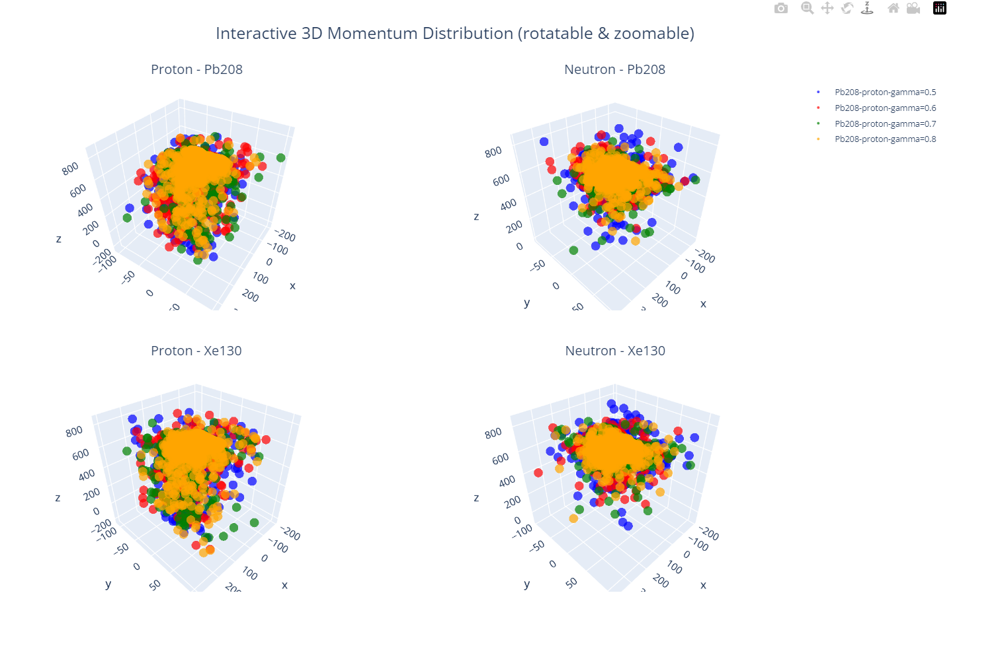
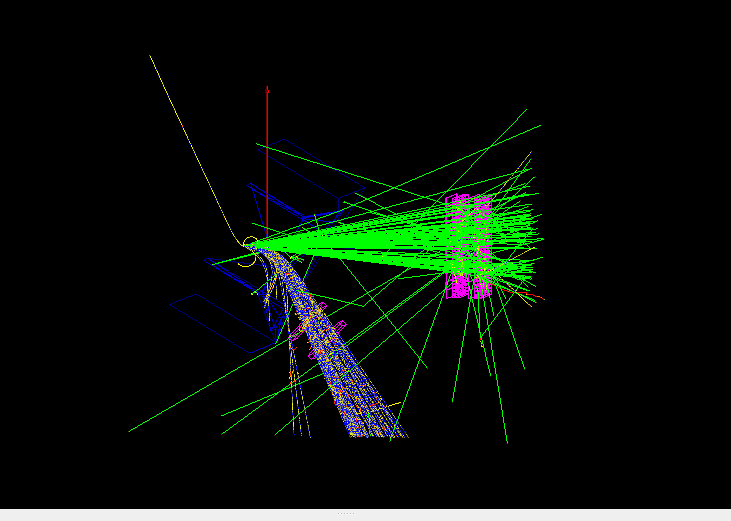
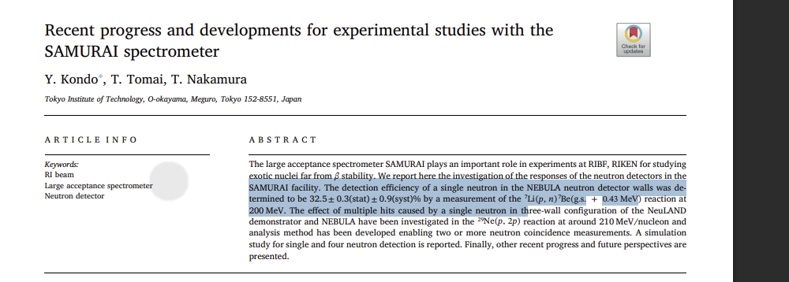
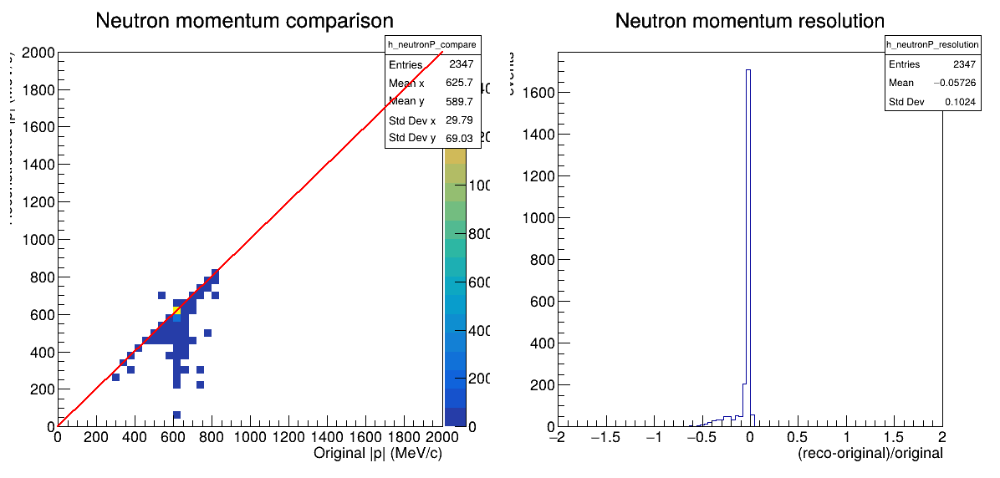
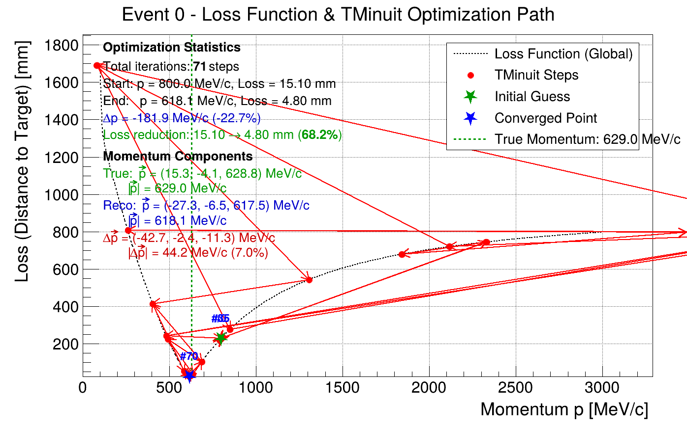
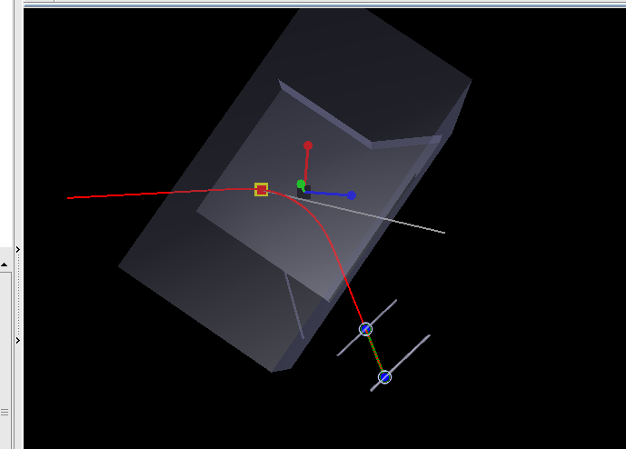
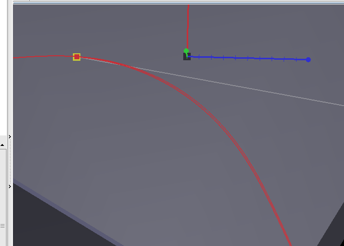
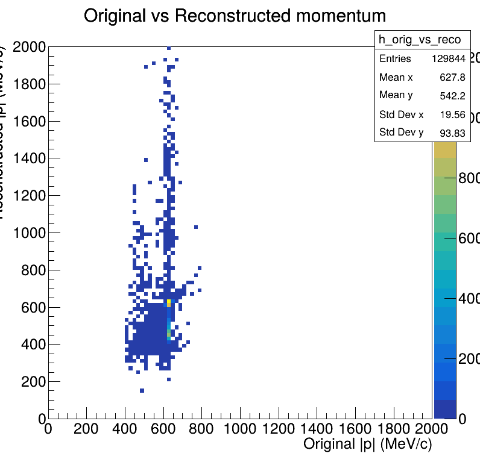
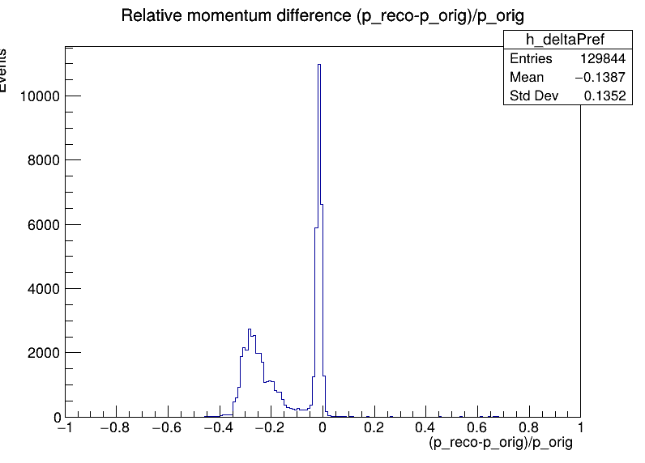

# Progress Report: Optimization of dpol_breakup Experiment Configuration

**Date:** November 26, 2025  
**To:** Mizuki, Aki  
**From:** Tian  
**Subject:** Progress on Simulation Framework and Configuration Optimization

---

## 1. Objective

The primary goal is to determine the optimal experimental configuration for the `dpol_breakup` experiment by evaluating detection efficiency and reconstruction accuracy under various setups.

**Key Questions:**
- What is the optimal target position for different magnetic field strengths?
- How does the beam deflection angle affect detection efficiency?
- What is the achievable momentum resolution with the current PDC setup?
- How can we improve reconstruction speed and accuracy?

---

## 2. System Architecture & Data Flow

We have established a complete simulation and analysis framework with the following pipeline:

```text
+---------------------+
|   QMD Raw Data      |  (~2x10^6 events per configuration)
|   (d+Pb, d+Sn, etc.)|
+----------+----------+
           |
           | Apply physical cuts, sampling
           v
+---------------------+
|   Geant4 Input      |  (~3x10^4 sampled events)
|   (ROOT/Macros)     |
+----------+----------+
           |
           | Configure geometry, magnetic field
           v
+---------------------+
| Geant4 Simulation   |  (~120 events/s)
| (Hit trees, EdepTree)|
+----------+----------+
           |
           | Extract hit positions and energies
           v
+---------------------+
| PDC Reconstruction  |  (~0.05-1 events/s)
| (Track fitting)     |
+---------------------+
```

**Components:**
- **Scripts**: Developed for QMD data transformation, cutting, sampling, and reconstruction analysis
- **Visualization**: Support for both 3D event display and batch processing
- **Status**: Core framework operational and ready for optimization testing

---

## 3. Performance Benchmarks

**Current Performance:**

- **Geant4 Simulation**: ~120 events/s
- **PDC Reconstruction**: ~0.05 - 1 events/s (using TMinuit to reconstruct proton momentum)
  - *Note*: The reconstruction speed is currently a bottleneck and is a primary focus for optimization
  - *Issue*: Performance is poor for some events, showing systematic momentum bias


---

## 4. Detailed Progress

### 4.1. QMD Data Processing



**Challenge**: The raw data volume is excessive (approx. $2 \times 10^6$ events per target/gamma configuration).

**Action**: Applied physical cuts to focus on the region of interest and reduce data volume.

**Applied Cuts:**

- **Momentum Cuts**: |p_y,p - p_y,n| < 150 MeV/c and (p_x,p + p_x,n) < 200 MeV/c
- **Angular Cuts**: |pi - |phi_rotation|| < 0.2 rad
- **Result**: Data volume reduced to ~3 x 10^4 events, significantly improving processing feasibility

<!--  这里画一个表格 -->


| Selection Stage | Conditions / Code Logic | Event Count | Remarks |
| :--- | :--- | :--- | :--- |
| **No Cut on P** | - Single target<br>- One special gamma | $2 \times 10^6$ | Initial large dataset |
| **Cut on P**<br>(Impact Parameter Selection) | `abs(pyp_orig - pyn_orig) < 150`<br>`(vec_sum_orig[0]**2 + vec_sum_orig[1]**2) > 2500`<br>`(pxp + pxn) < 200` | $5 \times 10^5$ | Cuts based on momentum and position to select impact parameter |
| **Further Cut on Angle** | `(np.pi - abs(phi_for_rotation)) < 0.2` | $3 \times 10^4$ | Final selection based on angular distribution |


**Next Step**: Implement systematic data sampling with stratified sampling to ensure uniform coverage of the phase space.

---

### 4.2. Geant4 Simulation

**Objective**: Evaluate detection efficiency across various experimental configurations.

**Current Configuration:**

- Target position: Configured based on a 5 degree beam deflection in a 1.2 T magnetic field
- Magnetic field strength: 1.2 T
- Detector geometry: PDC1, PDC2, NEBULA array
- Beam energy: 190 MeV/nucleon (deuteron)

**Simulation Results:**


*Figure 1: Visualization of accumulated 5000 simulated events showing particle trajectories in the detector system.*


*Figure 2: Detection efficiency (an event is counted as detected if it records any energy deposit in the Geant4 tree). Configuration: beam rotated by 5° in a 1.2 T magnetic field. Deuteron initial coordinates fixed at x' = b(impact parameter), y' = 0, z' = 0 (z is not randomized).*

**Comparison with Reference Data:**


*Figure 3: Detection efficiency from reference paper for comparison.*


*Figure 4: Experimental setup diagram from previous presentation slides.*

**Planned Parameter Scan:**

Generate multiple candidate macros with varying:

- Magnetic field values: 0.8 T, 1.0 T, 1.2 T,??
- Target positions: Aligned with optimal PDC acceptance regions
- Beam deflection angles: 0 deg (outside magnet), 5 deg, 

---


### 4.3. PDC Analysis & Reconstruction

**Reconstruction Methodology:**

Since the PDC primarily determines the particle **direction**, the reconstruction algorithm optimizes the **momentum magnitude** by minimizing the distance between the back-propagated track and the known target position.

**Algorithms Implemented:**

1. **Grid Search**: Robust global search but computationally expensive
2. **Gradient Descent**: Fast but sensitive to local minima and noise
3. **TMinuit (ROOT)**: Currently the primary method (using MIGRAD/SIMPLEX algorithms)

**Current Issues:**

1. **Reconstruction Quality**: While many events are reconstructed correctly, a subset shows poor results
2. **Momentum Bias**: Analysis of momentum residuals (Delta p = p_reco - p_true) reveals a **double-peak structure**:
   - Peak 1: Around 0 MeV/c (correct reconstruction)
   - Peak 2: Around -200 MeV/c (systematic underestimation)
3. **Speed Bottleneck**: Reconstruction takes 1-20 seconds per event

**Optimization Focus:**

- Tuning the Runge-Kutta (RK) stepping for charged particle motion in the magnetic field to balance precision and speed
- Refining TMinuit convergence criteria to avoid local minima
- Implementing better initial momentum guess based on PDC direction

**Reconstruction Results:**


*Figure 5: Comparison between reconstructed neutron momentum and input momentum from QMD data.*


*Figure 6: TMinuit optimization step-by-step debugging visualization showing convergence behavior and iteration details.*


*Figure 7: 3D event display showing particle trajectories, PDC hit positions, and detector geometry.*


*Figure 8: Zoomed view of the event display focusing on the target region and track back-propagation.*

**Example Reconstruction Output:**

```text
Input: proton, |p| = 629.0 MeV/c
Initial momentum guess: 800 MeV/c

MIGRAD failed with error code: 4
Trying SIMPLEX algorithm...

TMinuit optimization completed:
  Best momentum: 618.13 ± 2849.91 MeV/c
  Final distance: 4.79785 mm
  Convergence status: 1 (3=converged)
  EDM (estimated distance to minimum): 2.84217e-14
```


*Figure 9: 2D histogram showing correlation between true and reconstructed momentum values.*


*Figure 10: Distribution of momentum residuals (Delta p = p_reco - p_true) showing the characteristic double-peak structure.*

---


---

## 5. Optimization Strategy

To address the low reconstruction speed (currently ~0.1-1 Hz) and accuracy issues, the following strategies are being implemented:

1. **Algorithm Optimization**: Adjusting the track calculation step size and magnetic field integration precision
2. **Batch Processing**: Implementing memory-efficient batch analysis by discarding unnecessary track objects during I/O
3. **Parallel Computing**: Enabling multi-threading to process multiple events simultaneously
4. **I/O Optimization**: Using asynchronous logging to prevent I/O blocking
5. **Smart Initial Guess**: Using PDC direction and typical momentum range to improve TMinuit convergence
6. **Adaptive Step Size**: Implementing adaptive RK step size based on magnetic field strength and curvature

---

## 6. Next Steps (Priority Tasks)

**High Priority:**

1. **Data Generation**: Complete QMD data sampling and generate final ROOT files for Geant4 input
2. **Performance Tuning**: Continue optimizing the Geant4 simulation and reconstruction code for speed
3. **Configuration Study**: Systematically test different target positions corresponding to various magnetic fields and beam deflection angles

**Medium Priority:**

1. **Physics Analysis**: Investigate isovector effects in deuteron simulations
2. **Systematic Studies**: Evaluate systematic uncertainties in momentum reconstruction
3. **Validation**: Compare simulation results with experimental data (if available)

**Low Priority:**

1. **Documentation**: Complete technical documentation for all analysis tools
2. **Code Cleanup**: Refactor and optimize codebase for maintainability

---

## 7. Technical Implementation Details

### 7.1. QMD Data Sampling

**Current Status:** Implementation in progress

**Planned Approach:**

- Stratified sampling based on momentum and angular distributions
- Ensure uniform coverage of physics-relevant phase space
- Target: 30,000 events per configuration (reduced from 2,000,000)
- Format: ROOT files compatible with Geant4 primary generator

**Tools:**

- `scripts/qmd_analysis/`: QMD data processing scripts
- Output format: BeamSimData ROOT objects

---

### 7.2. Geant4 Simulation

**Implementation Status:** Fully operational

**Key Components:**

- **Geometry**: SAMURAI spectrometer setup with PDC chambers and NEBULA
- **Physics Lists**: QGSP_BIC_HP for hadron interactions
- **Magnetic Field**: Uniform field map (configurable strength)
- **Primary Generator**: Reading from QMD-derived ROOT files
- **Output**: Hit positions, energy deposits, particle IDs

**Configuration Files:**

- `configs/simulation/geometry/`: Detector geometry definitions
- `configs/simulation/physics/`: Physics list configurations
- Magnetic field maps: *(excluded from Git, stored locally)*

---

### 7.3. PDC Analysis & Reconstruction

**Core Algorithm:** Track back-propagation with momentum optimization

#### 7.3.1. PDC Hit Reconstruction

The PDC analysis reconstructs particle hit positions from two drift chambers using a **Center-of-Mass (CoM) weighted energy deposition** method.

**Reference:** `libs/pdcanalysis/src/PDCSimAna.cc:177-202`

**Process:**

1. Process U and V layer hits independently
2. Apply Gaussian position smearing for detector resolution (sigma ~ 200 micrometers)
3. Reconstruct 3D positions at PDC1 and PDC2
4. Transform coordinates accounting for spectrometer rotation angle

**Key Classes:**

- `PDCSimAna`: Main analysis class (`libs/pdcanalysis/include/PDCSimAna.hh:22-61`)
- Hit position formula: Center-of-mass weighted by energy deposition

#### 7.3.2. Runge-Kutta Integration (Core Physics Engine)

The trajectory calculation uses **4th-order Runge-Kutta integration** for solving particle motion in magnetic fields.

**Reference:** `libs/pdcanalysis/src/ParticleTrajectory.cc:159-206`

**Physics Implementation:**

```cpp
// Relativistic kinematics
E = sqrt(p² + m²)

// Lorentz force equation
dp/dt = q(v × B)

// Integration parameters
Step size: typically 1.0 mm
Physics constant: 89.87551787 (for unit conversion)
```

**Code References:**

- RK4 implementation: `ParticleTrajectory.cc:159-206`
- Magnetic field integration: `ParticleTrajectory.cc:120-157`
- Unit conversion constant (line 141): 89.87551787

**Performance Considerations:**

- Trade-off between step size and accuracy
- Smaller steps → higher accuracy but slower computation
- Current step: 1 mm (can be optimized to 2-5 mm for speed)

#### 7.3.3. Momentum Optimization with TMinuit

**Approach:** Minimize distance between back-propagated track and target position

**Objective Function:**

```text
chi^2 = sqrt((x_track - x_target)^2 + (y_track - y_target)^2 + (z_track - z_target)^2)
```

**Algorithm Sequence:**

1. Use PDC1 and PDC2 hits to determine particle direction
2. Make initial momentum guess (typically 600-1000 MeV/c)
3. Run TMinuit MIGRAD algorithm
4. If MIGRAD fails (error code 4), fall back to SIMPLEX
5. Extract best-fit momentum and uncertainty

**Challenges:**

- Local minima in chi^2 landscape
- Large uncertainty estimates (indicating convergence issues)
- Systematic bias for certain momentum ranges

#### 7.3.4. NEBULA Neutron Reconstruction

For neutral particles (neutrons), a completely different approach is used.

**Reference:** `libs/nebula/src/NEBULAReconstructor.cc:203-271`

**Methodology:**

1. **Time-of-Flight (TOF)** based reconstruction (no magnetic field effect)
2. Energy-weighted position clustering
3. Time window clustering (default: 10 ns)
4. Energy threshold filtering (default: 1 MeV)

**Physics Formulas:**

```text
Beta calculation: beta = (flight_distance / flight_time) / c
Lorentz factor: gamma = 1 / sqrt(1 - beta^2)
Kinetic energy: KE = (gamma - 1) x m_neutron
Momentum: p = gamma x m_neutron x beta x c
```

**Key Parameters:**

- Time window: 10 ns (clustering threshold)
- Energy threshold: 1 MeV (noise rejection)
- Position resolution: ~5 cm (limited by bar size)

---

## 8. Summary

**Achievements:**

- [x] Complete simulation framework operational (QMD -> Geant4 -> Reconstruction)
- [x] Multiple reconstruction algorithms implemented and tested
- [x] Identified key bottlenecks: reconstruction speed and systematic momentum bias
- [x] Established baseline performance benchmarks

**Current Challenges:**

- [!] Reconstruction speed: 0.05-1 Hz (target: >10 Hz)
- [!] Momentum bias: Double-peak structure in residuals
- [!] Large statistical samples needed for configuration optimization

**Next Milestones:**

1. Complete QMD sampling and generate production-scale input files
2. Optimize reconstruction algorithms to achieve >10 Hz performance
3. Run systematic configuration scans (magnetic field, target position)
4. Validate against experimental data and published results

---

**Contact:**

For questions or collaborations, please contact:

- Tian: <tbt23@mails.tsinghua.edu.cn>
- Repository: [Dpol_smsimulator](https://github.com/tianbaiting/Dpol_smsimulator)

---

**Report Generated:** November 26, 2025
