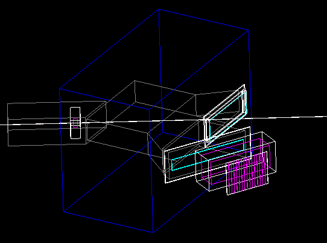
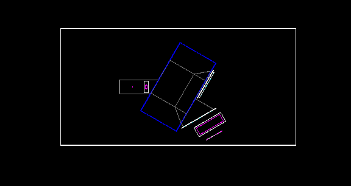
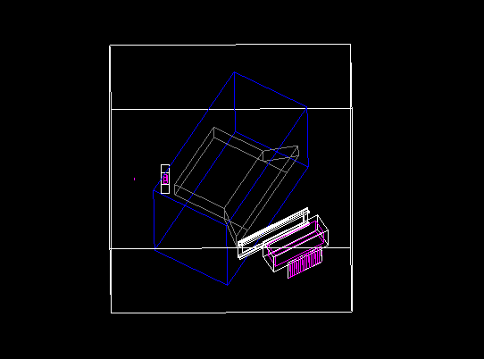
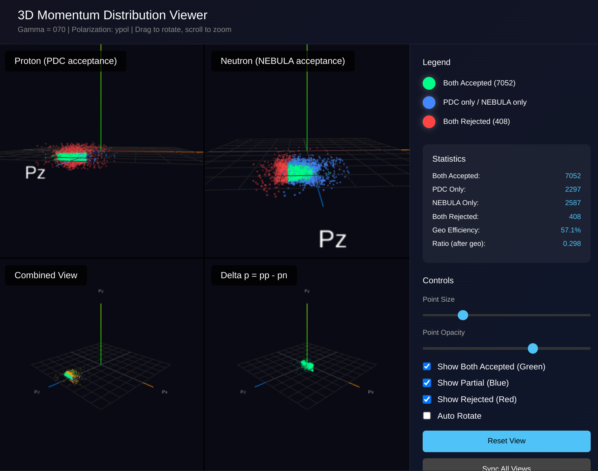
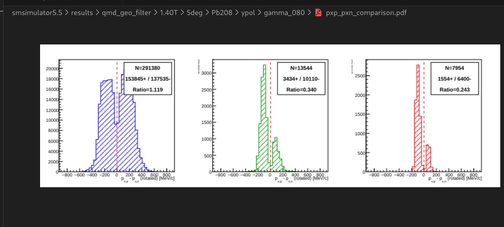
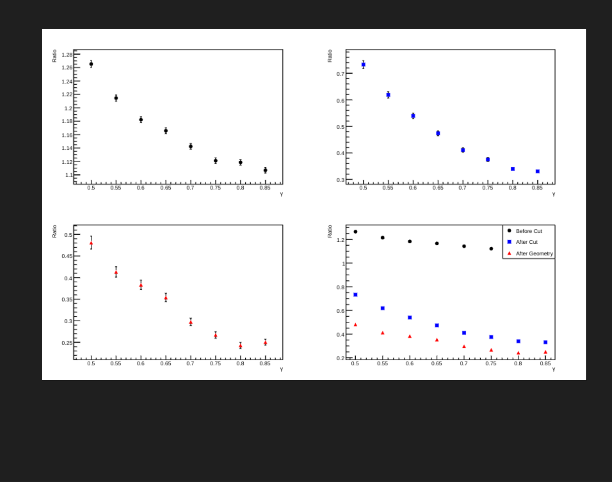
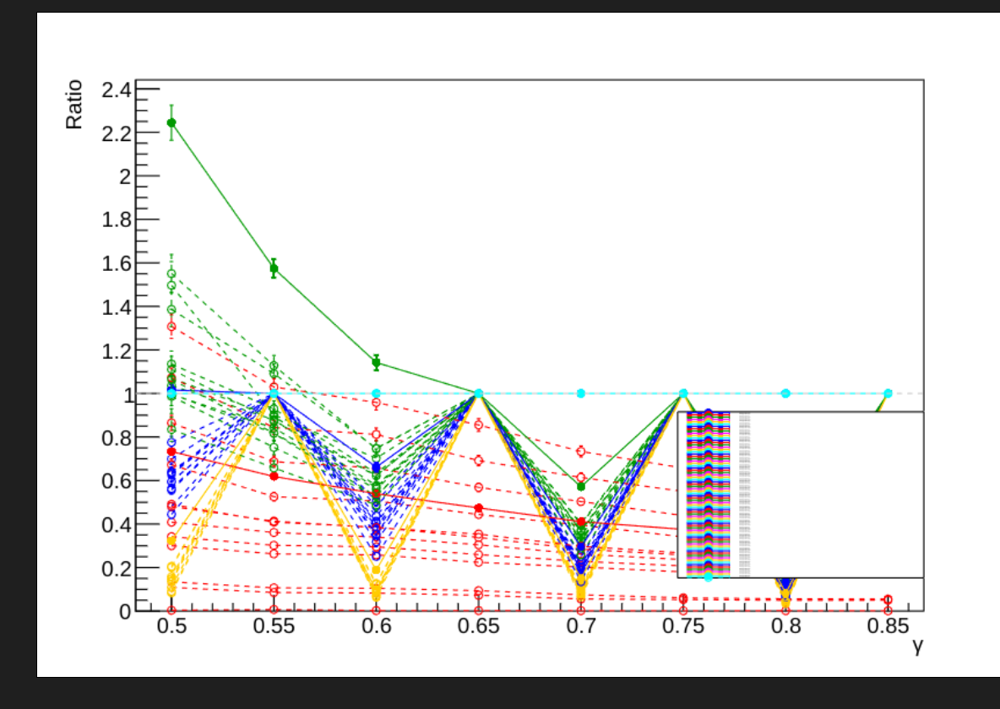

# Progress Report: Simulation Fidelity & Geometric Acceptance Analysis

**Date:** December 22, 2025
**Author:** [Your Name/Group]

## Executive Summary

This week's work focused on two main areas: enhancing the realism of the Geant4 simulation (`smsimulator`) by integrating detailed exit window geometries, and developing a specific analysis pipeline to evaluate the impact of geometric acceptance on the $P_{xp} - P_{xn}$ observable using QMD model data.

## 1. Geant4 Simulation Upgrades

### 1.1 Development Environment Fixes

Before the simulation updates, the development environment was optimized:

* **VSCode Intellisense:** Fixed include path issues by generating a `compile_commands.json` database via CMake (`set(CMAKE_EXPORT_COMPILE_COMMANDS ON)`).
* **Standards Update:** Unified the C++ standard to `c++20` across `CMakeLists.txt` and IDE configurations.

### 1.2 Neutron Exit Window Integration

The Neutron Exit Window (`ExitWindowN`) was successfully integrated into the main simulation loop.

* **Implementation:** Added `ExitWindowNConstruction` and attached a Sensitive Detector (`FragmentSD`) to the window volume to track particle interactions.
* **Code Structure:** Updated `DetectorConstruction` headers and implementation to handle the instantiation and memory management of the new window class.
* **Dependency Resolution:** Resolved linking errors by correctly including the `smdevices` library in the CMake configuration for `smg4lib` and `sim_deuteron`.


simtrace 有c2 

fix Bug. and run 


cd $SMSIMDIR/work
$SMSIMDIR/sources/build/projects/simtrace/simtrace

don't show window


c1 





### 1.3 Charged Particle Exit Window: C1 vs. C2 Analysis

A comparative analysis was conducted between two existing versions of the Charged Particle Exit Window found in the legacy codebase: **Version C1** (legacy) and **Version C2** (modern).

| Feature | ExitWindow C1 (Legacy) | ExitWindow C2 (Current) |
| :--- | :--- | :--- |
| **Usage** | Used in `simdayone` | Used in `simtrace`, `sim_samurai21` |
| **Geometry** | Simple rectangular box | Detailed structure with flanges/ribs |
| **Material** | `G4_Galactic` (Vacuum) - *Likely oversimplified* | `G4_Fe` (Iron) - *Realistic* |
| **Aperture (Y)** | **400 mm** | **800 mm** |


simdayone c1 exit window 





simtrace c2 exit window





**Conclusion:** The C1 version has a significantly smaller vertical aperture (400 mm vs 800 mm) and lacks material definition for the frame. Using C1 restricts the acceptance for the Plastic Drift Chamber (PDC) in certain configurations. **C2 has been adopted** for future simulations to ensure realistic material budget and acceptance coverage.


## 2. Geometric Acceptance & QMD Analysis

A new analysis tool, `RunQMDGeoFilter`, was developed to study the $P_{xp} - P_{xn}$ observable under realistic experimental conditions.

### 2.1 Methodology

* **Input:** QMD model data (targets: Pb208, C12; polarization: zpol, ypol).
* **Filtering Pipeline:**
    1.  **Momentum Cuts:** Standard phase space selection.
    2.  **Geometric Filter:** Particles are propagated through the magnetic field (e.g., 1.0 T). Events are kept only if the proton hits the PDC and the neutron hits NEBULA.
* **Configurability:** The tool accepts parameters for magnetic field strength, beam bending angle, target type, and polarization axis.

### 2.2 Preliminary Results

#### A. 3D Momentum Distributions

Visualization of the phase space before and after cuts demonstrates the significant "shaping" effect of the spectrometer geometry.

* **Before Cuts:** Isotropic/Model-defined distribution.
* **After Geo-Filter:** The acceptance carves out specific regions of the $(P_x, P_y, P_z)$ phase space, highlighting the correlations required for coincidence detection.

*3D Momentum Distribution (Acceptance Visualization):*




#### B. $P_{xp} - P_{xn}$ Asymmetry

The distributions of the transverse momentum difference ($P_{xp} - P_{xn}$) were analyzed.

* **Observation:** The distributions remain roughly same trends but differ  to the geometric acceptance.
* **Ratio Analysis:** The ratio $R = \frac{N(P_{xp}-P_{xn}>0)}{N(P_{xp}-P_{xn}<0)}$ (or similar asymmetry metric) was plotted against the beam Gamma factor.
    * The ratio plots reveal distinct trends for different targets (Pb vs C) and polarization states (zpol vs ypol), validating the sensitivity of the observable to the physics input within the detector acceptance.


*Detailed Distribution Analysis:*





*Ratio Plot (Asymmetry vs Gamma):*







```bash

# 磁场强度列表 magnetic [T]
# 可用: 0.8, 1.0, 1.2, 1.4
FIELD_STRENGTHS_FULL=(0.8 1.0 1.2 1.4)
FIELD_STRENGTHS_QUICK=(1.0)
FIELD_STRENGTHS_CUSTOM=(1.0)

# 束流偏转角度列表beam rotation [deg]
DEFLECTION_ANGLES_FULL=(0 5 10)
DEFLECTION_ANGLES_QUICK=(5)
DEFLECTION_ANGLES_CUSTOM=(5 10)

# 靶材料列表 target materials
TARGETS_FULL=("Pb208" "Sn124" "Sn112")
TARGETS_QUICK=("Pb208")
TARGETS_CUSTOM=("Pb208")
# 极化类型列表 polarization types
POL_TYPES_FULL=("zpol" "ypol")
POL_TYPES_QUICK=("zpol")
POL_TYPES_CUSTOM=("zpol" "ypol")

# Gamma 值列表  
GAMMA_VALUES_FULL=("050" "055" "060" "065" "070" "075" "080" "085")
GAMMA_VALUES_QUICK=("050" "060")
GAMMA_VALUES_CUSTOM=("050" "060" "070" "080")

```

## 3. Next Steps

1.  **Resolution Effects:** Implement momentum smearing functions to test how detector resolution affects the observed $P_{xp} - P_{xn}$ distributions and ratio stability.
2.  **Systematic Scan:** Generate the full suite of reports for all magnetic field and angle configurations using the new scripting infrastructure.