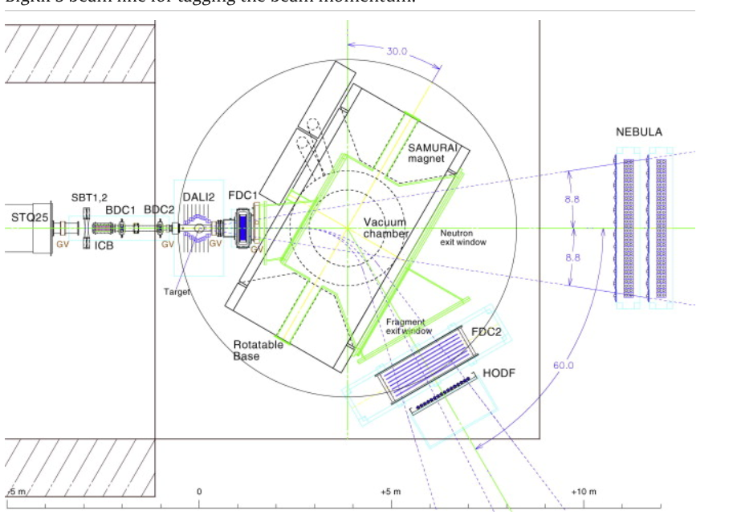
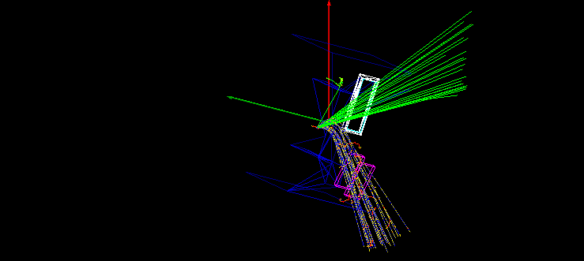
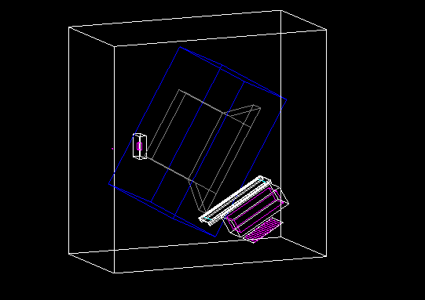
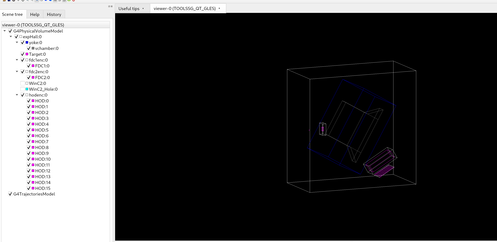

# Weekly Report — 2025-12-09 to 2025-12-12

This report summarizes work done in the `smsimulator5.5` repository from 2025-12-09 to 2025-12-12. Image paths use relative references based on this file location `docs/reports` pointing to `docs/note_log/assets/log202512`.

## 2025-12-09

- **Work**: Load different software paths per machine using `hostname` (switch software configuration by host).
- **Inspection**: Examined several ROOT data files and confirmed that TBrowser opening behavior is related to custom class loading logic.

## 2025-12-10

- **Goal**: Fix ROOT-related issues (.root files auto-expand nested objects in TBrowser and load custom classes; need to use ROOT reflection).
- **Observation**: Geant4's `nebula` does not have a similar automatic reflection mechanism; referred to personal notes:

    https://tianbaiting.github.io/sci/minimal_code/cernrootData/

- **Fixed CMake / ANAROOT linking issues**:
    - Enumerated ANAROOT libraries under `$TARTSYS/lib` and found `libanacore.so`, `libanaloop.so`, `libanacatana.so`, `libanadali.so`, `libanasamurai.so`, `libanabrips.so`, `libanaespri.so`, `libanasilicons.so`, `libanawinds.so`, etc.
    - Extended the `find_library` list in `CMakeLists.txt` to automatically append existing ANAROOT libraries to `ANAROOT_LIBRARIES` (no longer only searching for `anaroot` and `XMLParser`).
    - Added ROOT `XMLIO` and `XMLParser` component support to provide `TDOMParser` / `TXMLDocument` / `TXMLNode` symbols required by ANAROOT components `anacatana` / `anasamurai`.
    - Reconfigured and built; targets such as `crosssection`, `get_pdgmass`, `simtrace` linked and built successfully.

Current status: compilation errors fixed; relevant targets build successfully. If new ANAROOT components are added later, the CMake configuration will auto-detect and link them (provided the library names are in the candidate list).

## 2025-12-11

- **Fixed VSCode IntelliSense include path issues**:
    - Updated `c_cpp_properties.json`, added the `compileCommands` field pointing to CMake-generated `compile_commands.json`.
    - Updated C++ standard to `c++20` (keeps consistency with `CMakeLists.txt`).
    - Added `set(CMAKE_EXPORT_COMPILE_COMMANDS ON)` in `CMakeLists.txt`; reconfigure produced ~113 KB `compile_commands.json` containing all compile units.


- **Procurement progress**: Started processing the `dpol detector` purchase contract 


Small calculation example:

PDC related angle calculation for 10 degrees:

```
627*tan(10/180.0*TMath::Pi())
(double) 110.55702
```

Illustration (relative path):



## 2025-12-10 (continued) — Added Neutron exit window

- **Referring to Konda's smsimulator code**: multiple projects have neutron exit window implementations (example snippet):

```cpp
//------------------------------ exit window for neutrons
fExitWindowNConstruction->ConstructSub();
fExitWindowNConstruction->SetAngle(magAngle);
fExitWindowNConstruction->PutExitWindow(experimentalHall_log);
if (fNeutronWinSD==0){
    fNeutronWinSD = new FragmentSD("/NeutronWindow");
    SDMan->AddNewDetector(fNeutronWinSD);
}
fExitWindowNConstruction->GetWindowVolume()->SetSensitiveDetector(fNeutronWinSD);
```

- **Need to declare in header**:

```cpp
class ExitWindowNConstruction;

private:
    ExitWindowNConstruction *fExitWindowNConstruction;
    G4VSensitiveDetector* fNeutronWinSD;
```

- **Initialization / destruction**: in constructor `fExitWindowNConstruction = new ExitWindowNConstruction();`, in destructor `delete fExitWindowNConstruction;`.

- **Integration issue**: found `device` submodule was not linked; must add `smdevices` library to CMake link lists for `smg4lib` and `sim_deuteron`.



## 2025-12-12

- **Added charged particle exit window**: there are two exit window versions in the project (C1 and C2).

    - `libs/smg4lib/src/devices` directory layout:

    ```
    . ├── CMakeLists.txt
        ├── DipoleConstruction.cc
        ├── DipoleConstruction.hh
        ├── DipoleConstructionMessenger.cc
        ├── DipoleConstructionMessenger.hh
        ├── ExitWindowC1Construction.cc
        ├── ExitWindowC1Construction.hh
        ├── ExitWindowC2Construction.cc
        ├── ExitWindowC2Construction.hh
        ├── ExitWindowNConstruction.cc
        ├── ExitWindowNConstruction.hh
        ├── MagField.cc
        └── MagField.hh
    ```

    - C1: primarily for `simdayone`, Y aperture 40 cm (400 mm).
    - C2: for newer projects like `sim_samurai21`, `sim_tm1510`, `simtrace`, Y aperture 80 cm (800 mm); larger aperture and more robust supports.

- **Fixes and run**: Fixed related bugs by referencing `simtrace`'s C2 implementation and rebuilt.



Run attempt:

```
cd $SMSIMDIR/work
$SMSIMDIR/sources/build/projects/simtrace/simtrace
```

without exit window:




i don't know why chaerged particle exit window is fixed or changbel. 
